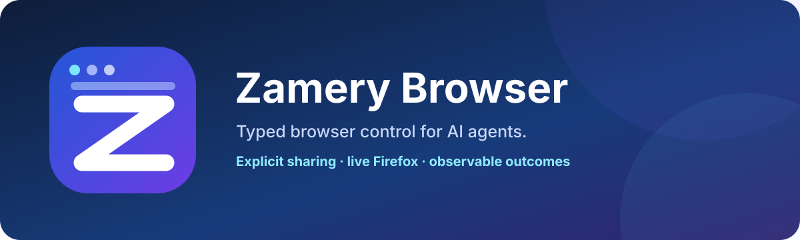
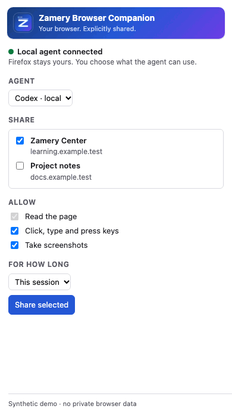

<p align="center">
  
</p>

<p align="center">
  <a href="https://github.com/maemreyo/zamery-browser/actions/workflows/ci.yml"></a>
  <a href="https://www.npmjs.com/package/@zamery/browser-mcp"></a>
  <a href="LICENSE"></a>
  <a href="https://github.com/maemreyo/zamery-browser/discussions"></a>
</p>

Typed browser control for AI agents, built around explicit capabilities, semantic snapshots, and observable action outcomes.

Zamery Browser lets an agent work with a browser through a provider-neutral contract instead of coupling the agent to one automation engine. The Firefox provider connects to the user's already-running Firefox rather than launching a disposable browser profile.

<p align="center">
  
</p>

<p align="center"><sub>Companion UI preview with synthetic example tabs; no private browser data is shown.</sub></p>

## Install

```bash
npm install @zamery/browser-provider @zamery/pi-browser @zamery/browser-firefox
```

Node.js `>=22.19.0 <25` is currently supported. `@zamery/pi-browser` is tested against `@earendil-works/pi-coding-agent@0.87.1`.

## Packages

| Package | Purpose |
| --- | --- |
| `@zamery/browser-provider` | Provider-neutral BrowserProvider V1/V2 contracts, plus optional bounded browser-asset contracts. |
| `@zamery/pi-browser` | Typed Pi tools for status, contexts, semantic snapshots, browser-backed assets, and actions. |
| `@zamery/browser-firefox` | Firefox provider, Native Messaging host, `setup`/`doctor` CLI and the Firefox companion for an already-running Firefox session. |
| `@zamery/browser-mcp` | Standalone stdio MCP server (for Codex and other local MCP hosts): share chosen tabs/tab groups, snapshots, DOM actions, takeover/resume, screenshots. |

## Architecture

```text
AI / Pi agent                 Codex / local MCP host
     |                               |
@zamery/pi-browser            @zamery/browser-mcp
     |                               |
     +-- BrowserProvider V2 + optional interfaces --+
                         |
              @zamery/browser-firefox
                         |
         Native Messaging + signed companion
                         |
              Your existing Firefox
```

The provider contract is intentionally separate from the Firefox implementation. Another browser/provider can implement the same contract without changing the agent-facing tool layer.

## Quick example

```ts
import { createBrowserProviderV2 } from "@zamery/browser-firefox";

const provider = createBrowserProviderV2();
try {
  const instances = await provider.listInstances();
  console.log(instances);
} finally {
  await provider.close();
}
```

For Pi integrations, `@zamery/pi-browser` exposes `browser_status`, `browser_contexts`, `browser_snapshot`, `browser_assets`, and `browser_act`. `browser_assets` returns opaque refs and safe metadata rather than source URLs or browser credentials.

## Codex and other MCP hosts

`@zamery/browser-mcp` lets a local agent work in the Firefox you already use — logged in, no relaunch, no cookie export — on **only the tabs or tab groups you choose to share**, for a time you choose (this session, or 1–30 days). You can take over at any time; the agent can only ask to resume. See [`packages/browser-mcp`](packages/browser-mcp/README.md), the [security model](docs/security-model.md) and the evidence-backed [release status](docs/technical-preview.md).

The `v0.2.3` release candidate uses `@zamery/browser-provider@0.2.3`, `@zamery/browser-firefox@0.2.2`, `@zamery/browser-mcp@0.1.1`, and `@zamery/pi-browser@0.2.2`, plus Mozilla-signed/public Firefox companion `0.2.5`. Its exact XPI/source tuple is verified; final stable promotion waits only on refreshed clean-distribution and signed real-profile acceptance. See the release status for exact evidence.

## Why this exists

Browser automation often hides important distinctions: whether the browser is user-owned, whether an action really happened, whether a DOM reference is still fresh, or whether a timeout occurred before or after mutation began. Zamery Browser keeps those boundaries explicit.

- The provider does not treat process success as browser authorization.
- Semantic snapshot refs are opaque and freshness-aware; they are not advertised as durable selectors.
- Actions preserve exact `completed`, `not_started`, `partial`, or `unknown` outcomes instead of converting ambiguity into success.
- Firefox actions are DOM-synthetic and are not represented as trusted OS input.
- Provider teardown does not imply ownership of the user's browser or tabs.
- Browser-backed asset discovery/transfer keeps sensitive source URLs and credentials provider-internal while exposing bounded opaque-ref workflows to consumers.

## Firefox companion

The Firefox path uses a Mozilla-signed Zamery Browser Companion plus a Native Messaging host. Current signed companion `0.2.5` uses protocol 2. Protocol-1 `0.1.x` components remain incompatible and fail closed when mixed with protocol-2 components. See [Firefox setup](docs/firefox-setup.md).

## Documentation

- [Getting started](docs/getting-started.md)
- [Architecture](docs/architecture.md)
- [Firefox setup](docs/firefox-setup.md)
- [Security model](docs/security-model.md)
- [Release status](docs/technical-preview.md)
- [Codex + Firefox community roadmap](docs/CODEX_FIREFOX_COMMUNITY_ROADMAP.md)
- [Security policy](SECURITY.md)
- [Privacy policy](PRIVACY.md)
- [Contributing](CONTRIBUTING.md)
- [Community support](SUPPORT.md)
- [Code of Conduct](CODE_OF_CONDUCT.md)
- [Brand assets](docs/brand.md)
- [Examples](examples/README.md)

## Project status

The npm packages are public under the `@zamery` scope and licensed under Apache-2.0. The API is still `0.x`: additive work can land in minor releases, while intentional breaking changes are documented with migration notes rather than silently reinterpreting an existing protocol version.

## License

Apache-2.0. Each package includes its own license file; the repository root license applies to the repository as a whole.
