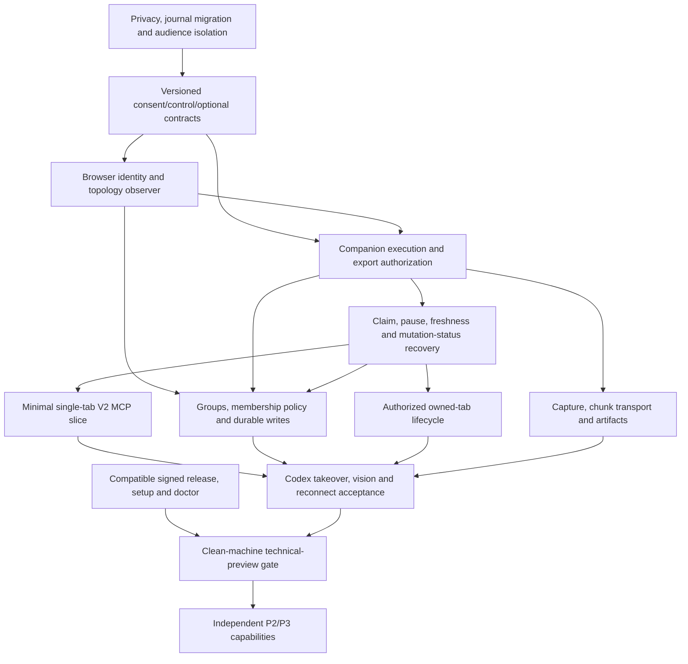

# Codex + Firefox Community Roadmap

Status: **Stable `v0.2.2` accepted for the scoped community release.** The original 2026-10-05 review below remains the design record; current release evidence is in [Technical preview status](technical-preview.md).

> **Implementation status (2026-10-06):** Stable npm artifacts, the Mozilla-signed companion, clean published-artifact installation, real authenticated-profile Firefox acceptance and the final release evidence are complete for `v0.2.2`. The text below remains the design record for the P0/P1 work and deferred P2/P3 scope.

This document is implementation design, not evidence that the features or security fixes already exist. See the [deep validation review](CODEX_FIREFOX_COMMUNITY_VALIDATION_2026-10-05.md) for findings F01-F15, exact code observations, primary sources S1-S27, contract recommendations, failure models and acceptance matrix.

## 1. Goal and product boundary

Make Zamery Browser a reliable path from Codex and other local MCP hosts to the user's existing Firefox, preserving authenticated sessions and user ownership without requiring Pi or Zamery Workbench.

```text
Codex / other local MCP host
  → @zamery/browser-mcp
  → BrowserProvider V2 + typed optional interfaces
  → @zamery/browser-firefox
  → Native Messaging host
  → Mozilla-signed Firefox Companion
  → user's existing Firefox
```

The first community promise is explicit sharing of tabs/groups, semantic inspection and DOM-synthetic actions, human takeover/resume, configurable consent duration, and actual model-visible screenshot verification. Provider cleanup never closes user Firefox. Login/MFA/passkeys/native choosers remain user controlled. Page data is untrusted input and cannot authorize browser/file access.

First preview: supported macOS builds/architectures declared by acceptance, desktop Firefox >=142, tested local Codex, pinned compatible Node/packages/XPI. No private-window control, trusted/native-input claim, full DevTools parity, automatic cloud access to a local browser, or guarantee of unattended authentication.

## 2. Observed baseline and provenance

At the reviewed HEAD:

- All three source packages are 0.2.0; source companion is 0.1.3, MV2, minimum Firefox 142.
- Public npm `latest` was provider 0.2.1, Firefox/Pi 0.2.0. npm Firefox embeds companion 0.1.2; latest GitHub v0.2.0 release also distributes a signed XPI named 0.1.2. Source capability is not proof of signed/distributed capability.
- V1/V2 provider contracts exist. V2 exposes provider session, ownership/freshness/frame/document provenance and four DOM action receipts. Semantic `providerExtensions` are metadata, not callable interfaces.
- Optional browser-asset V1 already implements bounded chunk/digest/replay ideas. Pi registers five tools including assets; its primary tool factory uses V1, with V2 binding exported separately.
- Authorization is in-memory, session-bound, 24-hour maximum, with duplicated source/runtime TTL constants. Current grant exports/probes all accessible tabs.
- Native journal persists raw `act.params` in a fingerprint, including fill/type/key text. Cached companion reads can replay before revoke checks. Snapshot masks only password value, exposing text/hidden values.
- Lower wire operations `create_tab`, `close_owned_tab`, `screenshot_probe` exist. Only `act` is durable. V2 maps all context ownership to user/preserve. Group operations and standalone MCP package do not exist.
- Screenshot probe uses explicit-tab capture but discards pixels, has no source abort/pre-encoding allocation guarantee and reports not ready.
- Public repo has no test/spec suite. CI builds/typechecks. Pinned web-ext lint passes; this does not prove browser behavior or privacy.

Revalidate source and **published artifacts** at each phase. Preserve exact package integrity/XPI hash, native protocol, Firefox/Node/Codex/macOS versions in acceptance. Do not treat this review as runtime acceptance.

## 3. Contract and compatibility strategy

Retain BrowserProvider V2 and all existing DOM-synthetic meanings. Add typed independently versioned optional interfaces with capability queries/type guards, following the asset V1 precedent:

- `BrowserTabProviderV1`: create/activate/navigate/reload/close-owned and later history operations.
- `BrowserTabGroupProviderV1`: list/get/create/update/add/remove/move/focus.
- `BrowserArtifactProviderV1`: capture + bounded artifact open/read/close.
- `BrowserAuthorizationProviderV1`: scope/expiry/reason status, without allowing agent self-grant.
- `BrowserControlProviderV1`: claim/pause/resume and safe mutation status.
- Diagnostic/file/frame interfaces only after their individual feasibility/privacy gate.

Do not widen required V2 methods or force group/tab receipts into its four-action receipt union. Existing V1/V2 consumers continue to work; optional control receipts have their own schema/tag and preserve exact `completed`, `not_started`, `partially_applied`, `outcome_unknown` outcomes. Native input, if later implemented, is separately declared, never a silent synthetic upgrade. Containers/private policy remain Firefox-specific partition metadata and authorization.

Revise the Firefox wire protocol (proposed revision 2) for mandatory scoped/audience/result-delivery authorization and recovery semantics. Negotiate feature/operation schemas and reject old broad-access fallback. Package semver, Provider V2, native revision, extension version and MCP protocol are separate axes. No V3 unless required core meaning/methods must change.

## 4. P0 — security, consent and single-tab foundation

### P0.1 Complete privacy and durable recovery boundary

Before introducing a new consumer:

- Durable metadata uses typed allowlists, excluding fill/type/key text, raw request fingerprints, sensitive errors and payload-bearing responses. No raw/unkeyed digest of passwords/OTP/PIN.
- Snapshot values are omitted by default, hidden/non-rendered fields excluded, sensitive authentication routed to explicit user takeover. Detection is defense, not a claim arbitrary page content is secret-free.
- Check authority at execution **and export**, including cached/in-flight read responses, asset/screenshot chunks, diagnostics and artifacts. Revoke invalidates grant revision, refs, claims, caches and transfer handles. It cannot recall already-delivered data or undo an applied mutation.
- Partition journal by trusted profile/audience, coordinate writers, cover all control mutations, preserve safe started/completed/tombstone status and documented replay horizon. Eviction/corruption must not silently permit old-key execution.
- Coalesce identical in-flight requests; conflict checking must not retain secrets. After restart without a text fingerprint, return conservative unknown rather than pretending exactly-once text replay.
- Upgrade legacy payload journal records to safe tombstones; remove managed legacy temp copies. Document old logs/backups and rollback restrictions; no secure-erasure claim.

Acceptance: independently specified negative scope/replay tests, fill/type/key/OTP/hidden canaries, mid-request revoke/expiry, legacy migration, response-loss/status reconciliation and multi-profile/audience failure probes. Probe reproductions in the review are not remediation evidence.

### P0.2 Scope and consumer authority

Companion is authoritative; provider checks are defensive. Filter out-of-scope tabs **before** content probing and before exporting IDs/titles/URLs. A local popup may inspect topology to present a picker without exporting it to the agent.

Default grant: resolved current tab, current origin, normal partition, this session; inspect/interact/capture. Tab identity is not an “always follow active tab” selector. Origin change pauses until confirmation unless user explicitly enabled follow-selected-tab navigation. Openers/popups/new tabs/ownership never imply grant.

Bind consent to an enrolled consumer audience, live transport and writer lease. Same-OS-user software is inside the local trust boundary; no claim that a caller-supplied Codex/task label is authenticated. Simultaneous chats require audience isolation or visible single-writer takeover. Provider never self-grants or expands access by moving tabs into a shared group.

Deny private windows in P0, preferably `incognito: not_allowed`; do not wait for future private support. Preserve per-selected-tab container partition identity; named container management is later. Explicit action grants distinguish inspect/interact/capture from reorganize/create/close-owned. All-tabs/origin-wide scope are deferred.

### P0.3 Configurable consent duration and restart semantics

```text
ConsentGrant
  schemaVersion, grantId, grantRevision
  trustedProfileId, enrolledConsumerId
  issuedAt, mode: session | fixed, durationDays?, expiresAt?
  selected tab/group handles, action grants
  navigationPolicy, normal partition policy
  restartPolicy: explicit_rebind

LiveBinding
  grantId/revision, providerSessionId, browserRunEpoch
  consumerConnectionId, writerLeaseId, claimGeneration
```

Presets: session, 1/3/7/14/30 days; custom integer 1-30 days initially. Session is default. Background validates intent and computes expiry; popup cannot supply arbitrary timestamps. The 30-day ceiling is a proposed product policy; 1-90 days and until-revoked have no reviewed justification and are deferred. Use one declared policy and source/runtime drift checks.

Session consent ends on native-host/extension binding replacement. Fixed consent survives as stored intent to its **original deadline**, but host/extension/browser restart needs explicit user rebind of consumer and live selected topology. Numeric tab/group IDs and titles cannot restore authority. MCP/Codex restart while host remains live may reconnect the enrolled audience, but discards old refs/claims. Clock regression cannot extend consent silently.

Expose detailed expired/revoked/disconnected/protocol/outside-scope/restricted reasons through optional status while preserving legacy V2 summaries. Queue-time expiry prevents start; after dispatch, settle safe status and stop further content export.

### P0.4 Browser observer and human-control foundation

Establish browser-run, document/frame, interaction, grant, topology and claim generations. Observe focused window/active tab directly; a 5-second heartbeat is not a mutation guard. Same-node edits and same-document SPA updates invalidate action observations.

```text
NoAccess → SharedIdle → AgentClaimed
AgentClaimed → UserControl on takeover/focus/interaction change
UserControl → SharedIdle on explicit resume and scope review
SharedIdle → AgentClaimed only with new lease and fresh snapshot
Dispatch loss → Reconcile → safe status / inspect / human review
Revoke/expiry → NoAccess; restart → explicit Rebinding
```

Preview writes target the claimed context in the focused window. No silent background-target continuation or active-tab retargeting. An explicit background-control mode is the bounded follow-up; implementation and acceptance are defined in [Background automation — fast implementation plan](BACKGROUND_AUTOMATION_PLAN.md). Takeover blocks queued writes, releases lease, invalidates refs and reconciles already-started work. Popup/new-origin selection requires user confirmation. Perfect observation/atomic focus+action cannot be assumed; implement explicit takeover and document residual races honestly.

### P0.5 Minimal standalone MCP vertical slice

No Pi/Workbench runtime dependency. Use V2 plus opted-in interfaces; no arbitrary model-selected module imports or JS/eval escape.

```text
browser_status
browser_contexts
browser_snapshot
browser_click
browser_fill
browser_type
browser_key
browser_handoff        # request_user_takeover | resume
browser_mutation_status
```

Use explicit instance/context/session/observation/ref/request IDs; preserve validated receipts and exact outcomes. Initialize stdio promptly without awaiting user grant. Tools remain discoverable while disconnected so status/setup/reconnect are usable; per-context readiness still gates execution.

Prove a single authorized existing-browser tab workflow and a second denied tab in development before implementing the full group UX. Tests accompany each contract slice.

## 5. P1 — macOS community technical preview

### P1.1 Groups with safe scope and internal events

Desktop APIs: tabs.group/ungroup and membership from Firefox 138; tabGroups get/query/update/move/events from 139. Baseline 142 covers availability; feature-detect APIs/permission. Add `tabGroups` permission. Firefox Android is outside scope.

Opaque handle maps to trusted profile + browser-run epoch + native group ID + generation. Numeric ID may change/reappear on restore; remove tombstones old handle; restart requires user reselect. Title/color are display data. Window is observed location, not permanent identity.

Operations map precisely to Firefox:

```text
list/get        → tabGroups.query/get + scoped tabs.query(groupId)
create          → tabs.group(nonempty tabIds), then optional update
update          → tabGroups.update(title/color/collapsed)
add/remove      → tabs.group / tabs.ungroup
move            → tabGroups.move(windowId/index)
activate/focus  → choose member + tabs.update(active) + windows.update(focused)
```

Return current revision, authorized members and incomplete-membership indication. Require authority over every affected tab for group-wide writes, including collateral unpin/reposition/split effects. Initial preview may reject pinned/split-view writes. Empty groups disappear; tabs.move can change membership implicitly. Firefox collapsed group may contain active tab; no inferred inactivity. Multi-step create/update/focus reports partial when later substep fails.

**Internal group/tab/window event observation is a prerequisite to group grant.** On events invalidate and re-query; never depend on a total atomic event order. Cover group created/updated/moved/removed and tab membership/created/removed/attached/detached/moved/replaced. External model event stream can wait.

Default `membership_snapshot`: selected members while remaining in group; leave removes group-derived access and re-entry doesn't silently restore it. Later tabs are not shared. Existing independent tab grants may remain.

Advanced `follow_group`: user explicitly opts in to future membership. Human additions still satisfy origin/partition/reconciliation policy; agent additions require independent pre-existing source-tab authority. Unknown concurrent provenance pauses expansion. Delete/recreate/restored IDs require new grant. Snapshot grants with unshared new members cannot silently authorize whole-group mutations.

### P1.2 Companion control/status UX

Show connection and shared access/control separately. Main picker: current tab, selected tabs, group. Local labels include hostname/container; group policy explanatory text sits beside selector. Reorganize/create are separate opt-ins.

Distinguish disconnected, connected/not-granted, protocol mismatch, granted/agent-controlling, granted/user-control, expired and reconnecting. Take over, resume, change access and revoke remain clear and immediate. Duration shows absolute local expiry plus countdown and original rebind deadline. Full UUIDs/paths/protocol fields only in redacted diagnostics. Default process label is Local agent, not an unverified Codex identity.

### P1.3 Owned tabs and focus correctness

Optional tab interface covers authorized create, activate, navigate, reload and close-owned. Register newly created identity only under explicit create/navigation/partition policy. Preserve ownership in V2 summaries. User-owned destruction, pin/unpin and full history management can wait.

All control operations have durable request/status/receipt semantics. Never repeat unknown create/close/navigation under a fresh request ID. Recheck grant/claim/document/topology/focus at dispatch; stale target resumes through explicit selection and snapshot.

### P1.4 Screenshot/artifact path and model vision

Use `tabs.captureTab(tabId)` for exact target. It requires `<all_urls>`; an optional-origin-only design cannot retain the same background capture promise. Keep broad permission disclosed and enforce actual grant in companion. Later activeTab/captureVisibleTab mode is separately scoped and needs real user gestures/race tests.

Initial proposed limits: one capture in flight; explicit rect in page-relative CSS coordinates from observed viewport/scroll; finite nonnegative coordinates, positive integer dimensions, scale `(0,1]`, <=4096 per side, <=8 million output pixels, <=8 MiB encoded image. Validate actual decoded dimensions and document/geometry afterward. PNG/JPEG supported honestly; do not auto-activate another tab when background capture is unavailable.

Firefox allocates a data URL before encoded byte checking and has no capture AbortSignal. Describe pre-encoding source allocation as best-effort; cancellation stops delivery/transfer, not guaranteed source capture. No Playwright viewport/device-emulation claim.

Chunk screenshot bytes, initially <=64 KiB raw with sequence/offset/current-chunk replay and terminal SHA-256. Validate complete envelopes under existing 256-KiB UDS and 1-MiB project-native limits. Reuse asset transport ideas without altering frozen asset V1.

Opaque immutable artifacts live in managed audience-scoped 0700 directories/0600 files, exclusive no-follow writes, atomic finalization and managed-root reads. Metadata includes media type/dimensions/byte size/digest/time/expiry/safe provenance. Proposed 30-minute lifetime, 64-MiB per audience and bounded count; cleanup on expiry/revoke/teardown; user export separate. Scope checked on every read. Historical artifact does not prove current document state.

Return compact metadata plus resource link and optional bounded inline MCP image; add `browser_artifact_read` with bounded-image mode (proposed 300 KiB/1600px). A resource ID alone is not model vision. Acceptance must prove Codex can actually read pixels and verify a visual fixture.

### P1.5 MCP preview surface and lifecycle

Add compact typed operation tools only when implemented:

```text
browser_tab            # create | activate | navigate | reload | close_owned
browser_groups         # list | get
browser_group          # create | update | add_tabs | remove_tabs | move | activate
browser_screenshot
browser_artifact_read
```

Descriptions expose side effects and readiness; no hidden grant expansion. Use structured outputs plus concise text; MCP annotations guide clients but don't grant authority. Do not advertise unavailable browser features based on provider-global declaration alone.

Prospective setup after publishing a tested package:

```bash
codex mcp add zamery-firefox -- npx -y @zamery/browser-mcp@<tested-version>
```

Syntax verified against official docs/local CLI; package/command does not exist yet. Prefer pinned installed executable for clean acceptance; test cold npx separately. Official startup/tool timeout defaults are 10s/60s; initialize without waiting for browser consent, measure suitable deadlines, and keep provider timeout below tool deadline. Stdio death is not guaranteed to autorestart on every Codex surface. Document tested recovery/rediscovery procedures and host versions. MCP exit releases its own resources, not shared host/Firefox.

### P1.6 Reconnect, doctor, installation and release provenance

Bounded exponential backoff/jitter for transport/reads. Mutations reconcile safe status before retry; timeout after uncertain dispatch becomes outcome_unknown. Protocol mismatch and ambiguous instances fail closed; no newest-session guess. Fixed consent rebind doesn't extend expiry.

Non-mutating doctor reports observed runtime/manifest/live-session/schema/consent/interface readiness and precise repair steps, without probing or exporting page content. No unverifiable companion-presence/version claim. Setup is explicit, with dry-run plan, compatible signed-XPI instructions, stable Node launcher path, no silent conflicting-manifest overwrite, upgrade/rollback and cleanup notes. No companion force-install or browser restart.

Release matrix distinguishes:

```text
source git SHA
provider/firefox/mcp/pi npm versions + integrity
signed companion version + SHA-256 + source provenance
native wire/operation versions
minimum and tested Firefox builds
Node, macOS architecture/build, Codex surface/build
```

Pin/review compatible sets; update CI/public tests alongside implementation. Automate extension lint/build, independent contract fixtures, broker failure tests and provenance checks. AMO listing is optional if signed unlisted XPI installation is reliable; signing/distribution/evidence are mandatory. `publish` lifecycle is separate from user acceptance. Preview update/rollback must not restore plaintext journals or broad authority.

## 6. Final community technical-preview gate

The [review's section 18](CODEX_FIREFOX_COMMUNITY_VALIDATION_2026-10-05.md#18-final-technical-preview-gate) is the detailed gate. All scenarios must pass on a single recorded artifact tuple:

1. Clean macOS installation from published pinned packages/signed XPI, GUI Firefox, no dev checkout/Pi/Workbench.
2. Existing logged-in ordinary Firefox session with one explicitly granted tab and unrelated denied tab.
3. Scope denial through provider **and direct broker**, including snapshot/cache replay/image/asset/artifact export and private windows.
4. Group read/write, snapshot/default follow opt-in, joins/leaves/recreate/last-member deletion/move and collateral-effect checks; no self-expansion by agent move.
5. Preset/custom duration validation and original expiry through popup/restart/rebind; mid-queue/mid-transfer revoke/expiry.
6. Manual takeover/MFA/click/navigation/SPA/focus/popup/same-node edit, stale observation rejection and explicit fresh resume.
7. Authorized owned tab create/navigate/reload/close with no duplicate effects after lost response.
8. Screenshot exact target/geometry/DPR/format/byte/pixel bounds, chunk replay/digest and actual Codex visual understanding.
9. MCP/native-host interruption, extension/Firefox restart, mismatch and documented reconnection/rediscovery without blindly replaying effects.
10. Canary inspection of journal/log/metadata/snapshot and legacy migration, cross-profile/audience isolation and single writer.
11. Compatible signed artifacts and upgrade/rollback/doctor checks from clean-machine evidence.

Unit/contract/integration/live Firefox/clean-machine results are distinct. Typecheck/lint and VM probes cannot stand in for live browser or distribution evidence. Record exact commands/run IDs, candidate identity, outcomes, unverified dimensions, reconciliation and rollback requirements. Stable `v0.2.2` passed this scoped gate; see [Technical preview status](technical-preview.md) for the accepted tuple and remaining non-blocking coverage gaps.

## 7. P2 — bounded diagnostics, files and complex pages

Introduce independently after feasibility/permission review:

- Scoped network metadata: webRequest plus required resource/main-page host authority; no headers/bodies by default, no tabless/speculative misattribution, honest event gaps. Console hooks aren't complete DevTools coverage; report start-time/context limitations.
- Frame enumeration and frame/document-aware snapshots/actions using V2 provenance; frame host permissions separate. Open shadow roots with provenance, closed roots explicitly unavailable.
- Downloads: optional downloads permission, attributable known IDs or user selection, complete/interrupted/missed-event reconciliation; no broad history/URL/path export. Artifact export needs separate exact-file native authority. Autonomous downloads.open is excluded because Firefox requires user action/extra permission.
- Upload research: file paths cannot be filled through DOM value. User chooser takeover remains supported. Bounded approved-byte File/FileList injection may be investigated separately; hidden input/drag/drop/native chooser/trusted upload completion aren't assumed. Native filesystem allowlist and destination consent mandatory.
- Existing selected container metadata; named enumeration/creation only after additional permission/account-isolation review. Private control still deferred.
- Optional model-facing group events and compact evidence bundle; neither changes grant authority or historical artifact meaning.

## 8. P3 — privileged/research paths

BiDi is optional advanced setup, not the existing-Firefox default. Firefox Remote Agent must be enabled at browser startup, so an arbitrary normal running session is not an attach target. Explicit same-profile restart may be feasible, but requires evidence of profile ownership, safe coexistence, teardown preservation and endpoint mediation. Never launch against a locked profile or auto-copy authentication state. No raw remote-debug/eval escape.

OS input/clipboard/drag-drop/dialog/permission/native chooser each have independent authorization and focus/global-effect receipts. BiDi automation-api input isn't synonymous with OS-native input; preserve honest mechanism/trust claims. Bounded video, performance, password-manager broker and a standard WebMCP bridge only if justified by demand and actual Firefox support.

## 9. Dependency-ordered execution



Start release/provenance/install work alongside core development; public tests accompany each slice. Group events are before group access. Single-tab consumer validation is before the whole group product. Reduce scope by deferring extras, not security/freshness/recovery evidence.

## 10. Deferred decisions and claims

Defer origin-wide/all-tabs authority, until-revoked/31-90-day grants, arbitrary user-tab close/pin/history, autonomous download open, HAR/bodies/network mutation, full console parity, private control, named container creation/deletion, video/performance, viewport emulation, consumer workspace abstraction, native input/dialog/clipboard and unsupported WebMCP.

Before phase promotion, resolve the review's remaining questions: reproducible publish provenance, affordable host/browser matrix, actual focus/interaction race limits, Codex vision/stdio lifecycle, enrolled-audience restart isolation, concurrent group-change provenance, upload/download feasibility. Keep uncertainty explicit; don't promote a documented API into a production-ready capability without live evidence.
