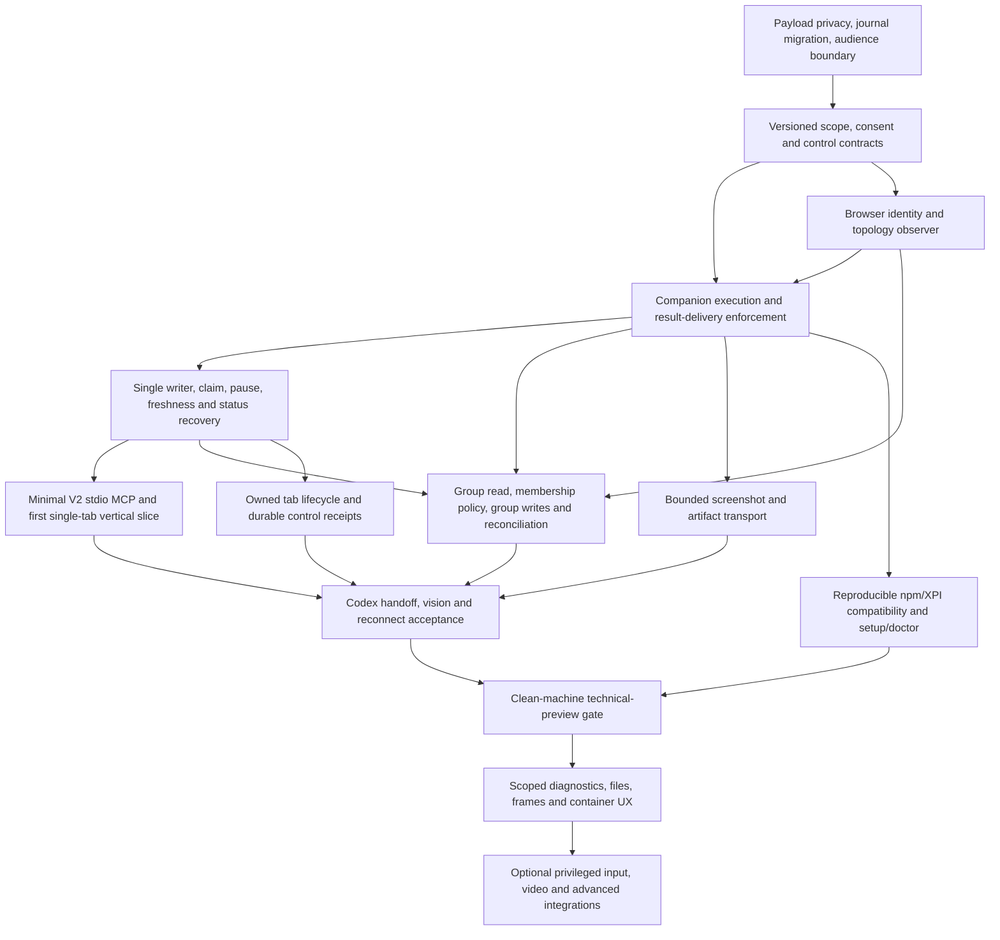

# Codex + Firefox community roadmap: deep validation

Date: 2026-10-05 (Asia/Ho_Chi_Minh). Scope: design review and documentation only.

Reviewed repository: `/Users/trung.ngo/Documents/zaob-dev/zamery-browser`, branch `main`, HEAD `89736c469fca46b98d0022de176f76f7f3c82017`. Entry state: modified `README.md`, untracked `docs/CODEX_FIREFOX_COMMUNITY_ROADMAP.md`. No repository or ancestor `AGENTS.md` was found in the inspected target path. The Zamery Center worktree is a different repository and was not changed.

Evidence classes: **observed** means inspected source or retrieved package data; **reproduced** means an isolated Node VM probe with mock browser/filesystem; **documented** means a primary external source; **proposed** means a design recommendation. No live Firefox, actual credential, installed native-host state, or real user journal was accessed. Documentation research establishes feasibility, not browser acceptance.

## 1. Verdict

**GO WITH CHANGES for implementing the revised plan. NO-GO for declaring the current code community-ready or releasing the advertised technical preview.**

The existing-browser architecture is viable. Firefox desktop exposes the needed group operations, and Codex supports local stdio MCP. The original roadmap under-specifies authorization enforcement, cached-response privacy, restart identity, operation recovery, and screenshot delivery to the model. Those are prerequisites, not polish.

Keep BrowserProvider V2. Add independently versioned, typed optional interfaces. Revise the Firefox broker/companion wire protocol for new mandatory authorization and recovery semantics. Do not conflate the public provider protocol, native wire protocol, MCP protocol, package semver, or extension version.

## 2. Findings by priority

P0 means a security/recovery prerequisite to exposing the new consumer. P1 means a technical-preview prerequisite. P2 means a later feature or improvement.

| ID | Priority | Finding and evidence | Required change |
| --- | --- | --- | --- |
| F01 | P0 | `runtime/native-host.mjs:50-145` serializes all `act.params` into the persisted fingerprint. VM probes reproduce plaintext fill, type, **and key** canaries in journal writes. | Sanitize the complete input path, not just two fields. Use a typed metadata allowlist; retain no reversible fingerprint or unkeyed digest of sensitive text. |
| F02 | P0 | `runtime/companion/background.js:192-247` serves cached/in-flight results before `executeRequest` calls authorization. Probe: fresh read denied after revoke, same-ID snapshot replay returns prior content. Native host also replays completed mutations before companion dispatch (`native-host.mjs:307`). | Authorize result delivery as well as execution; bind caches to grant revision/audience; separate safe mutation status from page-bearing responses; clear/restrict caches on revoke. |
| F03 | P0 | `background.js:1058` queries and probes every accessible tab after one session grant. `content.js:52-61` omits only password values; text/hidden values survive. Both value paths reproduced. | Filter before probing/exporting. Omit values by default, exclude hidden/non-rendered controls, suppress OTP/credential fields; manual credential handoff starts in P0. |
| F04 | P0 | Grant is in-memory and native-session-bound (`background.js:39,155,261,1350`), but roadmap suggests persistent multi-day authorization. | Separate stored consent lifetime from transport binding. Explicit restart/reattachment policy; never rematch tabs/groups by name or naked numeric ID. |
| F05 | P0 | Native host uses one user-wide journal path for all profiles, without inter-process coordination; entries indexed by request ID alone, only `act` is durable, oldest entries evicted at 256. Static evidence `native-host.mjs:15-16,54,124-145`. | Partition journal by trusted profile/consumer authority; single writer or locking; include audience and epoch; extend to all control mutations; define replay horizon/tombstones. Atomic rename alone does not coordinate writers. |
| F06 | P0 | UDS access is restricted by OS user, not authenticated Codex/task identity. Factories accept `clientId`, but Firefox options and broker wire have no verified client binding. | State the same-OS-user trust boundary honestly. Trusted setup pairing plus per-connection writer lease/grant audience; labels are informational. Do not claim cryptographic Codex attestation. |
| F07 | P1 | `provider-v2.ts:388` maps all contexts to user/preserve despite companion owned-tab metadata. `client.ts` rejects on disconnect/timeout; V2 `act` has no catch converting post-dispatch transport loss to `outcome_unknown`. | Preserve ownership; normalize failures by dispatch phase; expose queryable operation status and validated receipts. |
| F08 | P1 | Only tab removal and a 5-second active heartbeat are observed in background. Same-node user edits do not invalidate refs (`content.js:103-110`); external-control freshness helper is opt-in. | Add grant/lease/interaction/document/topology generations, focus guard, action-time rechecks, and explicit pause/resume. No inferred takeover from a heartbeat. |
| F09 | P1 | Concurrent same-ID **read** requests overwrite the native `pending` waiter (`native-host.mjs:337`); VM probe resolves the second and orphans the first until timeout. | Coalesce identical in-flight requests; reject conflicts; retain a waiter set. Bound all pending/cache resources. |
| F10 | P1 | Tab groups absent; manifest lacks `tabGroups`. APIs exist from 138/139, below 142 minimum [S1-S5]. Numeric group ID may change/reappear on restore [S2]. | Versioned group handles plus topology observation and live revalidation. Events must precede group-scoped authorization, not follow preview. |
| F11 | P1 | `screenshot_probe` is explicitly not ready. It does not forward bytes, cannot abort capture, and does not bound encoding allocation before capture. Probe passes negative scale/non-numeric limit to a mocked capture. Default viewport sizing can race resize. | Honest bounded-capture contract, validated explicit rectangle/scale, chunk transport, artifact store, and a model-visible bounded image route. |
| F12 | P1 | Public repo has no test/spec files or test scripts; CI builds/typechecks only. AMO prepare script exists but is not in CI. | Public behavioral/contract/integration tests and clean-machine acceptance of exact signed/npm artifacts. Lint/typecheck alone does not prove these behaviors. |
| F13 | P1 | Release provenance differs: HEAD packages 0.2.0 and companion 0.1.3; npm provider 0.2.1, Firefox/Pi 0.2.0; npm Firefox embeds companion 0.1.2, matching latest v0.2.0 XPI [S20-S23]. | A tested compatibility manifest and reproducible release provenance. Do not infer source 0.1.3 is signed/distributed. |
| F14 | P1 | Semantic snapshot includes at most 250 matching controls and misses ordinary visible article/body text. | Label coverage/truncation, prioritize visible nodes, include bounded readable content needed by primary inspect workflows. Avoid claiming a full accessibility tree. |
| F15 | P2 | Upload, download attribution, console, and native input assume capabilities not implemented or established. | Feasibility gates and narrow capabilities; no parity promise based on Playwright/Chrome feature lists. |

## 3. Roadmap reconciliation

| Roadmap item | Current reality | Problem | Recommendation | Priority |
| --- | --- | --- | --- | --- |
| Remove fill/type persistence | Full JSON request fingerprint is persisted, key text also included | Incomplete threat boundary | Allowlists, migration, status-only recovery, redacted errors | P0 |
| Scoped grant | Current session grant exposes all accessible tabs | Picker would only hide UI without enforcement | Companion authority plus defensive provider filtering; reads/replays/transfers gated | P0 |
| Configurable days | Volatile grant resets on session change | Long duration gives misleading persistence expectations | Consent lease + live binding; explicit restart policy | P0 |
| Companion UI | Grant/revoke plus protocol and UUID | No scope, client identity or handoff state | Small access/control surface, diagnostics separate | P0/P1 |
| MCP tools | No MCP package; Pi tool factory uses V1; V2 binding exported separately | Reusing Pi silently loses V2 semantics | Independent V2 consumer; typed optional interfaces | P0/P1 |
| Group read/write | No handlers or permission | API availability alone is not integration | Add `tabGroups`, lifecycle generation, topology reconciliation, structured receipts | P1 |
| `follow_group` default | Planned automatic expansion | Agent can move a sensitive tab into grant | Snapshot default; opt-in follow with independent authority on every added tab | P0/P1 |
| Group events in P2 | Required for scope withdrawal | Security dependency arrives after release | Internal event observation before group grant; external stream may stay P2 | P0/P1 |
| Tabs | Create/owned-close exist only on wire | Outside durable mutation journal; V2 drops ownership | Tab side-interface with request/status/recovery protocol | P1 |
| Screenshot reference | Probe discards image | ID alone does not provide model vision | Artifact + opt-in bounded MCP image output | P1 |
| Handoff | No explicit lease/pause/resume | Same connected node remains actionable after manual changes | Consent → claim → pause → fresh resume; focus/action-time guard | P0/P1 |
| Reconnect | Native reconnect every 1s; new session revokes | No backoff, no trusted continuity, plain transport throws | Bounded retries for reads; reconciliation for mutations; user rebind after host restart | P0/P1 |
| Setup/doctor | Install API exists, no package bin; source setup doc is manual | Command examples describe future commands | Non-mutating doctor + explicit installer; verify GUI-launched Firefox Node path | P1 |
| Private policy in P2 | Firefox user can allow extension in private windows; no incognito filter | Normal session grant may include private data | Deny private in P0; separate support only later [S11] | P0 |
| Containers | No context metadata policy | Same origin does not mean same account | Preserve partition identity in P0, named container management later | P0/P2 |
| Upload | DOM `fill` cannot set a file path [S13] | Picker/drag/drop are different capabilities | User chooser first; bounded file-byte injection research separately | P2/P3 |
| Download open | Firefox API needs user action and extra permission [S12] | Agent tool cannot promise autonomous OS open | Observe/export separately; local user action for opening | P2 |
| BiDi | Requires Firefox startup flag; endpoint is highly privileged [S14] | Cannot transparently attach to arbitrary ordinary session | Optional explicit advanced adapter, outside preview | P3 |
| Console/network | No diagnostics implementation | Page hooks are not DevTools and have coverage gaps | Scoped bounded observation, report missing coverage | P2 |
| Technical preview | All P0/P1 items listed without concrete evidence schema | Missing privacy/replay/TTL/artifact failure cases | Scenario gate in section 18, exact release candidate IDs | P1 |

## 4. Incorrect, stale, or unproved assumptions

- Source companion 0.1.3 is **not** the distributed baseline. The current npm Firefox tarball and release XPI are 0.1.2; public provider `latest` is independently 0.2.1. This is observed drift, not proof of incompatible APIs.
- Architecture doc says four Pi tools; actual factory registers five, including `browser_assets`. Optional browser-asset V1 already provides bounded chunking, terminal digest, and replay scaffolding. Screenshot should reuse transport ideas, not redefine that frozen same-origin asset contract.
- `providerExtensions` in V2 is bounded scalar semantic metadata, not an executable extension registry. Merely adding `firefox/group-v1` metadata cannot implement group calls.
- Multi-day consent and native-session binding are different clocks/identities. Changing TTL constants does not provide restart continuity.
- “Selected tab” must mean a resolved tab identity at confirmation time. “Current tab” cannot silently mean whichever tab happens to be active on every future call.
- A group does not have a guaranteed durable numeric authority ID. Matching restored groups by title/tabs may help display suggestions; it must never grant permission automatically.
- `follow_group` plus agent group editing can turn reorganization into privilege escalation. Scope expansion needs independent tab authority or direct human selection.
- `<all_urls>` cannot simply be replaced with per-origin permission while retaining arbitrary background `tabs.captureTab` [S6]. Active-tab-only capture is a different product mode.
- Artifact metadata/resource links alone do not establish that Codex loaded image pixels. Actual model-image acceptance is required [S15].
- There is no frozen total event ordering across tabs/groups documented by the APIs. Design from queryable state, invalidation, and revisions; do not invent an atomic group event transaction.
- No ordinary WebExtension path guarantees trusted input, automated native chooser interaction, or DevTools parity. Playwright's existing-browser extension path is Edge/Chrome-only [S18]; Chrome DevTools MCP officially supports Chrome [S19].
- Proposed `setup`, `doctor`, MCP, group and screenshot commands do not exist at this HEAD. Keep examples explicitly prospective.

## 5. Security and privacy design

The companion owns browser authority. Provider/MCP checks improve clarity, but extension checks must prevent bypass through the broker. A process speaking the old wire directly must not gain wider access.

**Data boundary.** Raw form values, page text, titles, URLs, screenshots, asset labels, query strings, response bodies, console strings, exception text and native logs can all be sensitive. Use typed allowlists for durable metadata; do not persist payload-bearing `response` objects. Mask URL credentials/query/fragment in diagnostics; don't pattern-redact arbitrary secrets and call that complete. Do not echo page-origin error strings or cancellation reasons into trusted diagnostic fields. Screenshot pixels inherently include visible private content; grant UI must explain transfer to the chosen AI host and artifact retention. No generic screenshot redactor can guarantee secret removal.

Snapshot defaults omit field values, exclude hidden controls, avoid password/OTP/credential metadata leaks, and identify redaction/truncation. Ordinary non-secret text entry remains allowed, but sensitive authentication routes to human takeover. Detection is a defense, not a proof that arbitrary page content is secret-free. Page text/tool-like instructions are untrusted data and cannot grant access, select an out-of-scope popup, or authorize filesystem reads.

**Revocation boundary.** Recheck live authority before starting queued work and before exporting every read response, cached response, screenshot chunk, artifact, or diagnostic. Invalidate refs/claim when grant revision changes. Abort/discard pending reads; drop caches and artifact handles. A mutation already dispatched may have applied: return safe status as unknown/partial/completed according to evidence, never claim revoke undid it. Revocation cannot recall content already delivered to a host.

**Journal migration.** Upgrade legacy journal schema without repeating uncertain work. Replace legacy payload records with minimal request tombstones and safe outcomes, remove legacy temporary copies under the host's managed state directory, and document that old logs/backups may remain. Never claim secure erasure. A rollback to a plaintext-writing host reintroduces the issue: block incompatible runtime downgrade while revised authorization is active. Review this with synthetic canaries, without collecting real user journals.

**Local trust.** Native manifest `allowed_extensions` identifies extensions; 0700 directories/0600 socket protect against other OS users. They do not isolate arbitrary software in the same account. The product trusts the local user account. Pairing a consumer enrollment secret and binding a live writer lease reduces accidental cross-chat access; it is not protection against a compromised OS account. Do not derive authority from an untrusted `clientId`, a Codex label, or page content. Multiple MCP chats require explicit independent audiences or a single active writer with visible takeover.

**Permissions.** Add `tabGroups` for group details/events; tabs grouping APIs themselves don't require that permission [S1]. Retain `tabs`, `storage`, `nativeMessaging`; don't add `downloads`, `webRequest`, cookies or clipboard speculatively. In this MV2 manifest, optional origin permissions belong in `optional_permissions`, requested from a user gesture [S9]. Prefer on-demand injection into allowed tabs. Exact-tab capture currently requires `<all_urls>` [S6], so preview can request it with honest explanation and strict companion scope checks. A later reduced-permission active-tab mode must expose its navigation/user-gesture limits and race behavior separately [S7].

Private windows are denied **now**, regardless of Firefox's extension setting. `incognito: not_allowed` is the simplest preview policy. If future support uses spanning mode, normal and private grants/handles/stores must stay isolated; Firefox does not implement Chrome's split extension mode [S11]. Existing container tabs may be selected individually; bind their partition (`cookieStoreId` when available) rather than assuming all same-origin tabs share one account. Named container enumeration/creation needs an additional permission review [S10].

## 6. BrowserProvider contract recommendation

**Retain V2 core with additive optional interfaces.** Current V2 already models provider session, ownership, frame/document provenance, freshness, four DOM actions and receipt validation. Its capability/action/error unions are finite. Do not force group/download results into `BrowserActionReceiptV2`, or insert arbitrary strings into the closed common-capability enum.

Export separate typed interfaces from browser-provider, each with its own protocol version, capability query and narrow structural type guard. Use the existing optional asset V1 pattern as the precedent. This can be a compatible package addition for existing V1/V2 consumers; no new required core method. Runtime operations are explicit methods on opted-in interfaces, not scalar declaration metadata.

| Feature | Contract placement | Compatibility decision |
| --- | --- | --- |
| Create/close/navigate/reload/back/forward/activate | `BrowserTabProviderV1` optional neutral interface | Additive; control receipt separate from DOM receipt |
| Group list/get/create/update/add/remove/move/focus | `BrowserTabGroupProviderV1` optional neutral interface | Additive; Firefox-specific restrictions declared explicitly |
| Screenshot + artifact open/read/close | `BrowserArtifactProviderV1` optional neutral interface | Additive; source allocation/cancellation limits explicit |
| Read scoped authorization/expiry | `BrowserAuthorizationProviderV1` optional status interface | Additive; richer states do not change V2 granted/revoked meanings |
| Group selectors and grant creation | Firefox companion policy; safe summaries to consumers | Browser UI owns grant; agent cannot self-grant |
| Claim/pause/resume, mutation status | `BrowserControlProviderV1` optional neutral interface | Additive; claim never expands consent |
| Console/network/download observation | Independent optional diagnostic/file interfaces after proof | Additive and capability-specific |
| Upload | Optional file-transfer interface after proof | Separate file authority; no local paths in page messages |
| Frames | Use V2 provenance + optional frame enumeration/snapshot targeting | Additive targeting path; navigation invalidates frame/document refs |
| Containers/private partitions | Firefox metadata and policy extension | Keep provider-specific; no mandatory neutral container semantics |
| Native input | Separate advertised semantics/adapter | Existing V2 mechanism can describe it, but synthetic capabilities retain meaning |

Control mutations require `requestId`, trusted audience, browser epoch/session, grant revision, claim generation, expected target/topology revision; result has a distinct validated `browser-control` receipt and the exact four V2 outcome strings: `completed`, `not_started`, `partially_applied`, `outcome_unknown`. Multi-step operations list completed substeps; no inferred rollback. Base V2 receipts are never fabricated for group/tab operations.

Firefox native protocol v1 cannot safely be interpreted as the new scoped/audience/recovery contract. Use a negotiated wire revision (proposed v2), operation schema and feature versions, with minimum companion/host pair published. Reject downgrade; no silent broad-grant fallback. BrowserProvider stays protocol 2. V3 becomes justified only if changing required core methods, existing receipt meanings, or mandatory action semantics—not to add optional features.

## 7. Firefox tab groups: final proposed design

Documented baseline: `tabs.group`, `tabs.ungroup`, tab `groupId` and membership-related APIs from desktop 138; `tabGroups.get/query/update/move` and four lifecycle events from 139. Current minimum 142 covers them. Feature-detect methods **and permissions**. BCD records these group APIs as unavailable on Firefox Android [S3-S5]. Research-time Mozilla release metadata reports desktop stable 157.0; test exact selected builds instead of assuming source main equals the minimum release [S24].

A public `groupHandle` resolves internally to `(trusted profile, browserRunEpoch, nativeGroupId, groupGeneration)`. Window is observed location, not immutable identity; a normal-window move updates location/revision. Tombstone on remove, even if Firefox restores/reuses an ID. Browser restart revokes topology-derived live handles. Neither title nor color is authority. Persisted consent may offer a re-selection suggestion, never automatic restored-group matching [S2].

Return `handle`, session/epoch, revision, window, title/color/collapsed, authorized member context handles, visible member count, and incomplete-membership flag. Default group listing exports only authorized groups/members; the human picker may inspect all local groups without exporting them to MCP.

| Operation | Firefox mapping | Exact rule |
| --- | --- | --- |
| list | `tabGroups.query`, joined with scoped `tabs.query({groupId})` | Paged, authorized members only; no full-browser inventory export |
| get | `tabGroups.get`, scoped members | Reject stale generation; report current revision |
| create | `tabs.group({tabIds,createProperties:{windowId}})` then optional `tabGroups.update` | At least one independently authorized tab; return partial if title/color update fails after creation |
| update | `tabGroups.update({title,color,collapsed})` | Allowlisted fields/colors; group-wide structural authority and complete affected-member authorization |
| add tabs | `tabs.group({groupId,tabIds})` | Independent authority for every source tab; cannot acquire it by moving into an authorized group |
| remove tabs | `tabs.ungroup(tabIds)` | Membership verified at start; removal may delete empty groups and withdraw scope |
| move | `tabGroups.move({windowId,index})` | Normal windows only; all affected members/adjacent side effects authorized; reread after move |
| activate/focus | Choose explicit authorized member, `tabs.update({active:true})`, `windows.update({focused:true})`; optionally expand | No group activation API; return chosen context and substep outcomes |
| observe | group created/updated/moved/removed + tabs groupId/created/removed/moved/attached/detached/replaced + window changes | Internal invalidation required for preview; external paged events later |

Groups require contiguous tabs. Grouping can unpin selected tabs; ungrouping can reposition them; removing/moving the last member deletes a group. Moving tabs into a group's interior can change membership without an explicit group call. Firefox collapsed groups can retain an active member; collapse does not mean inactive. Prevent implicit unpin unless separately consented; preview may reject pinned/split-view writes. Current docs describe grouping/ungrouping a whole split view through one selected tab: discover and authorize the entire effect set or refuse; don't back-project this behavior onto 142 without testing [S1,S4,S5].

`tabGroups.move` rejects placements amid pinned tabs/another group and only allows normal target windows. Firefox source additionally rejects normal/private cross-boundary moves; cross-window adoption is represented as move rather than genuine remove/create events [S1,S8]. Source inspection is evidence of implementation intent, not an event-order guarantee across releases.

Treat every topology event as invalidation. Re-query before scope-sensitive exports/mutations; maintain a monotonic observer revision and a resync-needed state. Serialize control writes per relevant topology/claim while acknowledging human/other-extension races. If a recheck cannot establish affected membership, fail before dispatch; if state diverges after a substep, report partial/unknown rather than replaying the whole sequence.

## 8. Authorization and configurable duration

Companion background is the policy engine. Provider-neutral optional status describes access state; Firefox-specific selectors and persisted consent live in the companion. The popup submits duration intent and explicit selections; it cannot provide an arbitrary expiry or trusted principal.

Proposed consent:

```text
ConsentGrant
  schemaVersion, grantId, grantRevision
  trustedProfileId, enrolledConsumerId
  issuedAt, mode: session | fixed, durationDays?, expiresAt?
  actions: inspect, interact, capture, reorganize, createTab, closeOwnedTab
  selectors: tabHandles[], groupSelectors[]
  partitionPolicy: normal only; container boundary per selected tab
  navigationPolicy: current_origin | follow_selected_tab
  restartPolicy: explicit_rebind

LiveBinding
  consentGrantId, grantRevision, providerSessionId, browserRunEpoch
  consumerConnectionId, writerLeaseId?, claimGeneration
```

Default: **current tab, current origin, this session**, inspect/interact/capture, no destruction or unrelated tab creation. The user confirms the resolved tab rather than a moving active-tab pointer. New-origin navigation pauses access for confirmation unless the user explicitly chose follow-selected-tab navigation. MFA/SSO remains possible through takeover and confirmation of changed origins. Unknown/restricted schemes deny access.

Selected tabs are explicit identities; a whole-origin selector is deferred because it can expose unrelated work/personal tabs. Origin is primarily a constraint intersecting tab/group/partition authority. All-tabs is advanced and deferred from first preview. Openers, popups, redirects and provider ownership do not themselves grant access. Creating a tab requires explicit create permission, destination window/partition and navigation policy; register the returned identity only after the authorized create operation. User-owned close requires a separately declared policy and is deferred.

Group policy:

- `membership_snapshot` default: freeze the authorized member set at grant confirmation and require current membership in that selected group. Leaving removes group-derived access; re-entry does not silently restore removed members. Existing independent tab grants may remain. UI says “Only these N tabs while they remain in this group; new tabs are not shared.”
- `follow_group` advanced: human opts in with “New tabs added to this group will be shared.” Human-origin additions can join after reconciliation and partition/origin checks. Agent-origin moves require prior independent source-tab authority; provider cannot bootstrap authority by moving an arbitrary tab into the group. Unknown provenance of a concurrent membership change pauses expansion for confirmation.
- With snapshot mode, newly added unshared tabs make group-wide update/move/collapse unavailable unless the user grants structural authority covering all affected tabs. Return incomplete membership without disclosing unshared URLs/titles.
- Deletion ends group authority; recreation/restore, including identical title or recycled ID, requires new selection. Ordinary same-epoch normal-window move retains the handle only after observation/revalidation; partition changes deny.

Duration is product policy, not a Firefox API limit. Proposed presets: session, 1/3/7/14/30 days; custom integer 1-30 days initially, session default. 1-90 days is technically implementable but has no reviewed security justification; revisit only with retention/rebind evidence. Until-revoked is deferred. Background validates safe integers/range and computes `expiresAt` from its clock. Use monotonic elapsed time within a run plus persisted expiry; large wall-clock regressions require revalidation, never extend a grant silently.

Session means this live binding; host or extension restart terminates it. Fixed consent can survive extension/browser/host restarts until original expiry, but **not** automatically restore tab/group execution authority: the user rebinds selected topology and consumer, keeping the original deadline. MCP/Codex child restart with a still-live host may reconnect using an enrolled consumer identity, discard old refs/claims, and get a fresh claim; do not recover by a caller label. Provider lifecycle never launches/replaces Firefox.

Expired, revoked, disconnected, protocol mismatch, outside scope and restricted-page are separate optional-status reasons. V2 may still report its legacy granted/revoked summary. Expiry/revoke at queue time prevents start; after dispatch, settle safe mutation status, cease data export, and request reconciliation. Grants union only within the same trusted audience; denying private/restricted surfaces takes precedence.

## 9. Companion UX

Use two visible facts: **connection** and **shared access/control**. A transport disconnect can coexist with stored consent; green “connected” never means authorized.

| State | Main message | Primary action |
| --- | --- | --- |
| Disconnected | Firefox companion ready; local bridge missing/stopped | Setup instructions; retry; diagnostics link |
| Connected, not granted | Connected to local agent; no tabs shared | Select tab(s)/group, duration, grant |
| Protocol mismatch | Components need a compatible update; access blocked | Show exact compatible version pair and repair instructions |
| Granted, paused | N tabs shared until time; you control Firefox | Resume after fresh target confirmation; change/revoke |
| Granted, agent controlling | Agent controlling named tab; N tabs shared | Take over; revoke |
| Expired | Access expired at local time | Renew with reviewed selection |
| Reconnecting | Connection recovering; actions paused | Take over/revoke remain available; bounded retry indicator |

Main picker defaults to current tab, shows title/hostname/container marker locally, and groups with member count. “Share” and “Allow reorganizing these tabs” are distinct because permission to inspect is not permission to rearrange or unpin. Group snapshot/follow explanation is adjacent to the picker. New tabs and all-tabs are never implicit defaults. Main duration selector shows session plus common days; custom is advanced. Show absolute expiry and relative countdown with correct locale/timezone, original deadline on rebind, and immediate change/revoke controls.

Do not promise the connected process is Codex unless trustworthy enrollment information supports that label. Say “Local agent” by default, with an informational client label. Full session IDs, paths, protocol versions, and logs belong in diagnostics. Copy-diagnostics excludes page titles/URLs, grants' private selection details, tokens and raw form values. Revoke clears claims and exports immediately. Visible status/badge plus explicit takeover button are required; automated detection of every human gesture is not feasible.

## 10. Codex/MCP architecture and tool set

`@zamery/browser-mcp` is a standalone Node stdio consumer of BrowserProvider V2 and typed optional interfaces. It does not depend on Pi or Workbench. Firefox is selected through explicit provider configuration/allowlisted factory; no model-provided arbitrary module path. Native host stays extension-launched; MCP teardown releases its own lease/transfers, never kills Firefox or the shared extension host.

Initial bring-up catalog:

```text
browser_status
browser_contexts
browser_snapshot
browser_click
browser_fill
browser_type
browser_key
browser_handoff        # request_user_takeover | resume
browser_mutation_status
```

Only four DOM mutation tools are separate, keeping action schemas small and semantics clear. They require explicit context, observed provider session, observation/ref and stable application request ID. One MCP JSON-RPC ID is not a durable idempotency key. Ordinary strings may contain ordinary non-secret text; credential fields require takeover. No eval/JS/CDP escape tool.

Preview adds a compact typed operation tool per optional surface:

```text
browser_tab           # create | activate | navigate | reload | close_owned
browser_groups        # list | get
browser_group         # create | update | add_tabs | remove_tabs | move | activate
browser_screenshot
browser_artifact_read # metadata | bounded_image; optional materialize for local clients
```

`back/forward` can be added when covered; history changes, pin/unpin and arbitrary user-close are not needed to prove first preview. Each operation advertises exact availability and effect class. Diagnostics/download/upload/frame tools arrive independently after proof; do not add dozens of synonyms for small differences.

Model-readable output has concise status plus schema-validated `structuredContent`; preserve receipts/outcomes and safe errors. Read-only/destructive/idempotency hints are host guidance, never permission. Click can submit a form or external action; “DOM click” is not synonymous with harmless. Capability-aware means advertise implemented interfaces at provider startup, return per-context readiness at call time, and enforce it in the companion. Keep implemented tool catalog stable while Firefox is disconnected so users can inspect status/grant/reconnect; do not remove all tools just because consent is absent. If optional interfaces change, use MCP list-change notification and test host refresh support [S15].

Documented prospective setup [S16], also confirmed by local Codex CLI 0.160.0 `mcp add --help`:

```bash
codex mcp add zamery-firefox -- npx -y @zamery/browser-mcp@<tested-version>
```

This command was **not** run to modify user config: package does not yet exist. For clean acceptance prefer a pinned installed local executable; cold `npx` network install is a separate startup case. Initialize MCP quickly without waiting for user authorization, then discover Firefox lazily. Official defaults are 10s startup and 60s tool timeout; document measured settings and keep provider deadlines below tool deadlines [S16]. No source establishes a guaranteed automatic stdio-child restart for every Codex surface. Test child death, reconnect command/new chat/client restart and tool rediscovery; document exactly which host/version recovers without host restart. Cloud Codex has no automatic route to this user's local Firefox; first preview targets local Codex.

## 11. Screenshot and artifacts

Observed probe already admits the core limitation. `tabs.captureTab(tabId)` is the correct explicit-tab API and requires `<all_urls>`; rect is page-relative CSS coordinates and scale is explicitly set, not accidentally inherited DPR. Without rect Firefox captures the viewport; PNG/JPEG have different defaults/quality rules [S6,S7]. API signature offers no AbortSignal or streaming output.

Proposed initial limits (product limits, not Firefox guarantees): one capture in flight per instance; positive integer rectangle width/height, finite nonnegative coordinates, scale in `(0,1]`, max 8 million output pixels and max 4096 per side; encoded image max 8 MiB. Smaller requested limits cannot raise the hard ceiling. Require explicit bounded rectangle for viewport capture using observed scroll/viewport geometry, revalidate document and geometry, and validate actual decoded dimensions afterward. Reject discarded/loading/restricted/private or inaccessible tabs; do not activate another tab to work around capture. Background capture may be reported unavailable until live tests establish rendering/freshness.

Encoded-byte ceiling is checked **after** Firefox returns the data URL. Firefox/browser memory used during rendering/encoding cannot be strictly bounded or preempted by this contract. Report source allocation as best-effort and capture cancellation as delivery/transfer cancellation, never guaranteed abort of source capture. Explicit rect/pixels/concurrency bounds limit requested work; invalid inputs, timeout, huge viewport, resize, concurrent navigation and dropped result all need evidence.

Do not send an 8-MiB base64 payload as one broker response. Existing UDS client cap is 256 KiB, native host cap 1 MiB, and asset V1 raw chunks are 128 KiB. The Mozilla native transport also distinguishes 1-MB host-to-extension from a larger extension-to-host API ceiling; project's 1-MiB inbound limit is intentionally stricter [S25]. Proposed screenshot chunks at most 64 KiB raw with sequence/offset, lost-current-chunk replay and terminal SHA-256; validate the **whole serialized envelope** against 256 KiB. This is an artifact interface, not browser-session asset fetch V1.

Native/consumer materializer writes to a managed per-user/audience artifact directory (0700; files 0600), uses opaque random IDs, exclusive no-follow creation, atomic finalization and managed-root-only lookup. Metadata: artifactId, kind/mediaType, actual width/height, byteSize, SHA-256, safe context/document/grant lineage, createdAt, expiresAt. Lifetime 30 minutes initially, total 64 MiB per audience with bounded file count; cleanup on expiry/revoke/session teardown, with explicit user export separate. No model-selected path or URL. Artifact identity is immutable bytes; document change makes it historical evidence, not current-page proof. Recheck scope/audience before each read and verify terminal digest before final publication.

MCP returns compact metadata/resource link and optionally a bounded downscaled image (`ImageContent`, proposed max 300 KiB/1600px). `browser_artifact_read(...bounded_image)` offers explicit model viewing when automatic screenshot image output is disabled. Local materialization is a tested fallback for clients with image-file readers. A generic custom resource URI alone is insufficient; verify the actual Codex model can read pixels and answer a visual question. Disk reference and inline image are different outputs [S15].

## 12. Human ↔ agent handoff state machine

```mermaid
stateDiagram-v2
  [*] --> NoAccess
  NoAccess --> SharedIdle: user grants scoped consent
  SharedIdle --> AgentClaimed: explicit target + writer lease + fresh observation
  AgentClaimed --> UserControl: takeover / focus change / interaction generation changes
  AgentClaimed --> Reconcile: transport loss after dispatch
  UserControl --> SharedIdle: user requests resume; changed scope reviewed
  SharedIdle --> AgentClaimed: new claim and snapshot
  Reconcile --> SharedIdle: safe operation status reconciled
  Reconcile --> UserControl: outcome unknown; inspect / human review
  SharedIdle --> NoAccess: expiry / revoke
  AgentClaimed --> NoAccess: expiry / revoke
  UserControl --> NoAccess: expiry / revoke
  AgentClaimed --> Rebinding: host/browser/extension epoch changes
  Rebinding --> SharedIdle: explicit user rebind; original expiry retained
  Rebinding --> NoAccess: consent absent or expired
```



Selected target, active tab in focused window, and claimed context are distinct. One active tab exists per window, so `active: true` by itself is not global visual focus. Preview mutates only the claimed tab in the focused window, verified directly at action time. Background mutations need a later explicit mode. Snapshotting is not claiming; activating does not grant permission; a claim is not permanent browser ownership.

Takeover releases writer lease, blocks new queued writes, invalidates old refs/observations and settles already-started operations. Trusted human pointer/keyboard/focus/navigation activity increments an interaction generation where observable; lease mismatch/focus change refuses start. Same-document SPA updates and edits to the same connected node invalidate actionable observations even when document identity is unchanged. Don't claim perfect detection of OS/native dialogs or every external action; explicit takeover is authoritative. The critical dispatch validation belongs near the browser mutation, with an explicit race limitation if Firefox cannot make focus+document+action atomic.

Login/MFA/passkey/chooser remain user controlled. After new document, origin, popup, tab/group move or browser restart, resume reacquires topology and authorization, selects an explicit context, obtains a new lease and snapshot, then continues. Popups are candidates shown to the user, not auto-authorized replacements. Never silently transfer a claim because another tab is active or has the same title. Mutation receipt completion proves the invocation/outcome it reports; success of authentication or a server transaction needs an independent read/visual check.

## 13. Reliability and recovery

| Failure | Required behavior | Retry/reattach rule |
| --- | --- | --- |
| MCP child/Codex exits | Drop client lease/transfers; preserve user's Firefox; retain safe operation status | Client restart reconnects to live enrolled audience; all refs/claims new |
| Native host dies | Pause; mutation dispatch ambiguity recorded; consent-to-transport binding invalid | Extension reconnect with bounded exponential backoff/jitter; user rebind if session changes |
| Extension reloads | Drop session grant, ephemeral refs/leases and topology generation | Fixed consent remains only as consent intent; rebind and rebuild state |
| Firefox restarts | All numeric tab/group IDs and epochs obsolete | User reselects restored topology; never title-match authority |
| Protocol mismatch | Discovery diagnostics available; all effects/data denied | Install tested component pair; no fallback to broad wire v1 |
| Response lost after mutation | Preserve request ID and dispatch phase; exact completed/partial/unknown state | Query mutation status; no new-ID automatic rerun |
| Grant expires/revokes mid-request | Prevent queued starts and new exports; already-applied effects cannot be undone | Report safe status; user review/regrant before new effects |
| Corrupt/evicted journal | Stop claim of durable replay for affected keys | Tombstone/expired request rejection or unknown; never silently execute old keys |
| Multiple clients/instances | Explicit instance and one writer lease per context/topology | No newest-heartbeat auto-selection when ambiguous; no cross-audience replay |

Reconcile operation identity at `(trusted profile, audience, run/consent lineage, requestId)`, not a global request string. Store safe started/completed/tombstone metadata and completed control substeps; no raw payload. Coalesce identical in-flight requests with multiple waiters and reject conflicting params where safe comparison is possible. Non-secret metadata and in-memory payload comparison can detect live conflict. After restart with no text fingerprint, preserve conservative unknown rather than pretending full conflict detection or guaranteed exactly-once input. Define a replay horizon and refuse keys outside it; a 256-entry LRU is not indefinite exactly-once semantics.

For text operations distinguish a request the host persisted from one the companion actually began. Transport write or socket success isn't proof of execution. Late results may settle safe status after timeout; canceled clients may ignore original MCP replies, so status must be independently queryable [S17]. Public V2 transport failures after uncertain dispatch must return `outcome_unknown`, not a generic throw interpreted as safely retryable.

Proposed error taxonomy lives in optional control/status interfaces; don't silently extend legacy enums in a patch:

| Error family | User action | Outcome/retry meaning |
| --- | --- | --- |
| HOST_MISSING / COMPANION_NOT_READY / TRANSPORT_DISCONNECTED | Install/start/reconnect | Reads can retry; mutation depends on dispatch phase |
| PROTOCOL_MISMATCH | Update compatible pair | Terminal until repaired; not started if rejected before dispatch |
| AUTHORIZATION_REQUIRED / EXPIRED / REVOKED / OUTSIDE_SCOPE | Review/grant in browser | No automatic regrant |
| CONTEXT_GONE / RESTRICTED_PAGE / FRAME_UNAVAILABLE | Select another authorized context | Not started if detected before mutation |
| CLAIM_CHANGED / FOCUS_CHANGED / STALE_OBSERVATION | Fresh explicit resume | No blind retargeting |
| REQUEST_ID_CONFLICT / REPLAY_HORIZON_EXPIRED | Inspect safe request status | Reject execution; never create a new ID automatically |
| OUTCOME_UNKNOWN / PARTIALLY_APPLIED | Reconcile/inspect/human review | No automatic retry |
| ARTIFACT_EXPIRED / SIZE_LIMIT / INTEGRITY_MISMATCH | Recapture when authorized | No partial artifact publication |

`doctor` is non-mutating: runtime/node path, manifest extension allowlist, candidate live sessions, protocol/schema versions, enrolled audience, scope/expiry summary without page data, optional-interface availability and signed artifact identity where observable. No companion installation/version claim without a handshake or verified installed artifact. Firefox version comes from observed browser info, not a sample “145.0”. Avoid probing all private page content to decide health. Setup is a separate explicit install/repair command with a dry-run plan, rollback notes and no silent overwrite of incompatible manifests.

## 14. Upload/download feasibility verdict

**Upload: conditional, not a preview promise.** A file input accepts browser-selected files, not assignment of an absolute local path through `.value` [S13]. WebExtensions don't provide an unconstrained local filesystem API or arbitrary native chooser control. The native host can read files, but that is separate local-file authority, not browser grant authority.

A bounded DOM-synthetic upload experiment may create `File` objects from user-approved bytes and set a FileList/dispatch events if actual Firefox/page behavior supports it. Visible/hidden input, multiple files and drag/drop need independent evidence; it cannot claim trusted chooser activation or successful server upload. Only a native file allowlist/materializer may supply bytes: enforce realpath, symlink/device restrictions, file/count/aggregate size, basename/type and transfer digest. Page content cannot choose arbitrary host paths. Consent must identify destination origin and files. Default preview flow is user takeover for chooser and fresh snapshot after selection. Synthetic injection or OS automation later requires a distinct capability and acknowledgment versus actual upload completion.

**Download observation: feasible with limits.** `downloads` permission enables creation/change/search events, filename, MIME/state/progress metadata [S26]. It is broad browser-download visibility, so scope and attribution are a hard design question: standard DownloadItem does not give a universally reliable source tab/document identity. “Most recent download after click” is not enough with concurrent user downloads. Ambiguous downloads require human selection. Avoid exporting complete user download history/paths/URLs.

Browser-owned download destination remains Firefox/user controlled. A completed download does not mean exported bytes exist in an agent artifact store. Explicit native materialization may read the exact granted download path after validating ownership, symlinks and content size/digest. Observe `complete/interrupted`, reconcile missed events by querying exact known IDs, and surface observation unavailable without declaring actual download failure. An opaque download handle and safe basename suffice until export.

**Autonomous download open: remove from initial plan.** `downloads.open` needs both `downloads` and `downloads.open` and a real user-action handler; opening can launch an external application [S12]. Replace the proposed unconditional tool with human “Show/open” or an explicit future native capability. Browser-backed media asset transfer already exists and is narrower than generic download management; don't confuse the two.

## 15. Trusted input / BiDi verdict

| Mechanism | Works with ordinary already-running user Firefox? | Trust/ownership boundary | Decision |
| --- | --- | --- | --- |
| WebExtension DOM synthetic | Yes, subject to companion grant/injection restrictions | Untrusted DOM events; no guaranteed browser defaults/native chooser | Preview mechanism; honest semantics |
| Firefox WebDriver BiDi | Only if Firefox was deliberately started with Remote Agent enabled | Privileged automation endpoint; separate auth/scope mediation needed | Optional advanced research, no transparent fallback |
| OS/native automation | Potentially controls ordinary window | Accessibility/input permissions, focus-sensitive global effects and native UI | Separate future adapter with visible opt-in and receipts |

Mozilla documents Remote Agent activation through `--remote-debugging-port`; it is loopback-restricted and exposes privileged user-session control including cookies without its own general authentication [S14]. Therefore an ordinary already-running Firefox without that flag is not an attach target. Deliberately restarting the same profile with the flag can preserve the real profile; that is possible advanced setup, not proof BiDi is impossible and not the no-restart hero workflow. Never launch a second process against a locked profile or auto-copy/export authentication state.

Before any BiDi adapter, prove existing-profile launch/connect, session teardown that preserves browser, user coexistence, permission mediation, input semantics and supported feature set. BiDi automation input isn't synonymous with OS input; declare the actual mechanism and observed trust separately. Source docs contain stale contradictory channel notes in some pages; this review uses the current Security page and treats minimum-build behavior as live-test work. Do not weaken the extension grant by exposing a raw unauthenticated remote endpoint to MCP.

## 16. Revised dependency graph



Implement the single-tab vertical slice before the full group product to expose consumer/freshness issues early. Group observer primitives must exist before group access; do not ship group-follow first. Begin release provenance and install acceptance early because signed-extension/native-host upgrades can constrain architecture. Tests accompany contract slices, not a last release-hygiene phase.

## 17. Revised P0/P1/P2/P3

| Phase | Deliverables | Exit evidence |
| --- | --- | --- |
| P0 safety and vertical foundation | Input/snapshot privacy, journal migration/replay/audience isolation, wire revision, consent/scope, private deny and partition identity, result delivery authorization, topology observer, handoff/claim foundation, minimal V2 MCP | Negative authorization/replay/canary tests; no-runtime-claims contract review; single authorized-tab inspect/action/takeover/resume in a development environment |
| P1 macOS technical preview | Full companion picker/duration UX, tab/group read/write with internal events, owned create/navigate/close, focused-target enforcement, artifact capture plus model vision, mutation-status/reconnect, setup/doctor, public tests/CI, signed compatible artifacts | Section 18 scenario matrix on exact npm/XPI candidate, existing authenticated browser, clean macOS installation and tested local Codex |
| P2 diagnostic/file/complex-page extensions | Bounded network observation, limited console coverage, frames/open shadow traversal, download observation/export after attribution proof, upload feasibility experiment, named container UX, optional external group events, simple evidence bundle | Per-capability permission/privacy/coverage matrix and live acceptance; no assumption of DevTools parity |
| P3 separately privileged/research capabilities | BiDi/OS input if feasible, native chooser/clipboard/dialog controls, bounded video/performance, standard WebMCP bridge if Firefox actually supports it | Explicit ownership/security contracts and demand-backed implementation case |

## 18. Final technical-preview gate

All required rows must pass for a **single release candidate tuple**: git commit, npm package versions/integrities, signed XPI version/SHA-256, native protocol/operation schemas, Firefox build, Node version, Codex surface/build, macOS build/architecture, clean-machine record and test run identifiers. The review itself is not such an acceptance record.

| Scenario | Minimum valuable evidence | Layer |
| --- | --- | --- |
| Clean install | Published pinned packages + signed XPI + GUI Firefox discover correctly; no dev checkout/Workbench/Pi/manual source patches | Clean-machine/live integration |
| Existing login | One pre-authenticated ordinary-profile site inspected without relaunch or cookie export; second unrelated tab inaccessible | Live Firefox + Codex |
| Single-tab grant | Local picker; other tab IDs, snapshot, image, asset read, cached IDs, URLs/titles and direct broker access all denied | Contract/integration/live |
| Group grant/write | Snapshot default and opt-in follow; joins/leaves, last-member removal, recreate, cross-window move, pinned/split effect refusal; independently unauthorized tab cannot be imported by agent | Unit model + integration/live |
| Duration | Session, presets and custom integer bounds; exact deadline; expiry/revoke in queued request and active transfer; popup/extension/host/browser restart and explicit rebind | Unit boundary/contract/live |
| User takeover/resume | MFA/manual click/navigation/SPA update/focus switch/popup and same-node edit; old observation fails; explicit context resume; no hidden background write | Integration/live Codex |
| Tab lifecycle | Authorized owned tab create/navigate/reload/close; user close refused; response loss has safe status; no duplicate create on recovery | Integration/live |
| Screenshot/model vision | Exact claimed tab, scrolled rect/resize/DPR cases; PNG/JPEG bounds, timeout/discard policy, chunk/digest replay; Codex answers a visual fixture question | Contract/integration/live Codex |
| Recovery | Kill MCP/native host independently; extension reload/Firefox restart; restored profile recognized but stale grants/refs rejected; documented recovery method works | Fault injection/live |
| Revocation/privacy | Typed/key/OTP/hidden-field canaries absent in journal/log/artifact metadata; legacy migration retains safe tombstones; cached replay after revoke denied; no private leakage | VM/unit + integration/live |
| Multi-client/profile | Wrong audience/status/artifact reads denied; one writer; independent profiles cannot overwrite/replay each other's journal entries | Contract/fault integration |
| Release compatibility | Old/new mismatched host/companion fail closed; signed candidate matches source; install rollback handled; doctor does not misreport unobservable companion state | CI/clean-machine |

Unit tests prove boundaries/clock/scope/revision logic; contract tests use independently specified fixtures and old consumer compatibility; integration tests exercise actual broker framing/state/failure behavior with a mock companion; live Firefox proves browser API/focus/event behavior; clean-machine proves distribution and installation. Do not test only helper output equality or equate typecheck/web-ext lint with functional acceptance. A test must cross the boundary its claim names.

Keep preview scope macOS, local stdio, ordinary Firefox desktop profile, no private control, DOM-synthetic inputs, no guaranteed automation of authentication/upload/native dialogs. Groups and configurable days remain part of the stated value; protect them with semantics above instead of silently removing them from the gate. Reduce scope by deferring pin/history/all-tabs/origin-wide grants and diagnostics, not by dropping privacy, handoff, signed install, image vision or recovery.

## 19. Defer/remove for ROI

Defer origin-wide/all-tabs grants, until-revoked and 31-90-day grants; arbitrary user-tab destruction/pin/history management; autonomous download open; full request/response bodies/HAR; network mutation; full DevTools console parity; video/performance; clipboard/native dialogs/drag/drop; viewport/device emulation; closed shadow roots; named-container creation/deletion; private-window support; consumer workspace abstraction; standard WebMCP bridge without Firefox evidence.

Retain manual credential/file-chooser handoff immediately. An elaborate password-manager broker is later; the no-secret-value boundary is P0. Internal group events are required now; model-facing event subscriptions can wait. Reuse optional browser-asset acquisition without expanding it to unrestricted local files. First community promise is selected real Firefox tabs/groups with recoverable control and visual verification, not a Firefox clone of Chrome DevTools.

## 20. Proposed patch, validation record, unresolved questions

The roadmap has been edited directly to encode these decisions and link this review. It remains a plan; no runtime/security issue is claimed fixed.

Files changed by this validation:

- `docs/CODEX_FIREFOX_COMMUNITY_ROADMAP.md`: replace speculative order/defaults with the reviewed baseline, contracts, security prerequisites, dependency phases and acceptance gate.
- `docs/CODEX_FIREFOX_COMMUNITY_VALIDATION_2026-10-05.md`: this review, source catalog and reproducible isolated probes.

`README.md`'s existing roadmap link was preserved, not introduced by this validation. No runtime/product source, package metadata, release pipeline, or user Codex configuration was edited. No commit was made; explicit documentation dirty-state handoff is intended. Migration/rollback/reconciliation requirements are proposals in sections 5, 8 and 13 and remain unimplemented.

Validation performed:

| Exact command/action | Result | What it proves |
| --- | --- | --- |
| `git status --short --branch`; `git rev-parse HEAD` | main / recorded HEAD; entry README modification + untracked roadmap | Baseline/worktree evidence |
| `rg --files --hidden -g AGENTS.md -g '!node_modules' -g '!.git'` plus ancestor-file checks | None in target repo/path | No target-specific AGENTS authority found |
| `rg --files --hidden -g '*test*' -g '*spec*' -g '!node_modules' -g '!.git'` | No matches; package scripts inspected | No public test suite at reviewed HEAD; not proof tests never existed elsewhere |
| `node /tmp/zamery-browser-validation-2026-10-05/audit-probes.mjs` | Exit 0; expected flaws reproduced with synthetic data | Journal payloads, cached replay after revoke, field-value exposure, screenshot argument gaps, duplicate read waiter |
| `pnpm --filter @zamery/browser-firefox typecheck` | PASS; provider pretypecheck build also passes | Provider/Firefox compile compatibility only |
| `pnpm --filter @zamery/pi-browser typecheck` | PASS; provider pretypecheck build also passes | Current Pi consumer compile compatibility only |
| `for f in packages/browser-firefox/runtime/native-host.mjs packages/browser-firefox/runtime/companion/background.js packages/browser-firefox/runtime/companion/content.js packages/browser-firefox/runtime/companion/popup.js packages/browser-firefox/runtime/companion/asset-discovery-v1.js packages/browser-firefox/runtime/companion/asset-transfer-v1.js; do node --check "$f" || exit 1; done` | PASS | Selected production runtime files parse |
| `pnpm dlx web-ext@10.6.0 lint --source-dir packages/browser-firefox/runtime/companion` | PASS: 0 errors, 0 notices, 0 warnings | Extension lint, not group/privacy/browser correctness |
| `codex --version`; `codex mcp add --help` | 0.160.0; stdio `-- <COMMAND>...` confirmed | Installed CLI syntax; no MCP config mutation |
| Python `urllib.request` primary-source GETs + JSON extraction | PASS except explicitly noted unavailable page paths | BCD support, Firefox source constraints, current release metadata |
| Python npm metadata/tarfile inspection in memory + GitHub latest-release API | PASS | Package versions, companion 0.1.2 distribution; no packages installed from tarballs |
| `git diff --check` | PASS | Tracked diff whitespace only; untracked documentation also checked below |
| `python3 /tmp/zamery-browser-validation-2026-10-05/verify-docs.py` | PASS | Both documents: whitespace/fences/local links, required review sections 1..20, cited npm integrities |
| `git diff --no-index --stat /tmp/zamery-browser-validation-2026-10-05/original-roadmap.md docs/CODEX_FIREFOX_COMMUNITY_ROADMAP.md` | 179 insertions, 694 deletions; exit 1 means documents differ | Revised roadmap compared with supplied untracked original |

Probe success means **reproduction assertions passed**, not vulnerabilities remediated. The script is reproduced in Appendix A so its evidence survives temporary-directory cleanup. Build outputs are ignored artifacts. `web-ext` fetched pinned lint dependencies into its tool cache; no project dependency/lockfile change.

Intentionally unverified: live browser APIs at minimum/stable builds; real tab-group event ordering and split views; actual background screenshot/focus race; model vision and MCP lifecycle on each Codex surface; signed-XPI/source byte equivalence; journal migration; clean macOS installs/Node upgrades; cross-profile concurrent durability; actual upload/download attribution; OS input/BiDi profile coexistence. No browser action, real credential inspection, AMO submission, npm publish, or runtime implementation was attempted.

Unresolved implementation questions that must be closed by evidence, not guessed:

1. Which artifact tuple will be the first candidate, and how does public provider 0.2.1 relate to source 0.2.0? Missing npm `gitHead` means publish provenance needs a release manifest, not inference.
2. What exact supported macOS architectures/Firefox channels/Node/Codex surfaces are affordable to test? Minimum 142 and current stable each need actual evidence; ESR 140 is below declared minimum and not implicitly supported.
3. Can Firefox reliably expose required focused-window/interaction/document generations close enough to action dispatch? Where it cannot, explicit takeover plus fail-closed focus restrictions and documented races are mandatory.
4. Does the selected Codex surface actually display/read bounded MCP image content/resources and recover stdio after child death? Source docs support MCP but do not settle every host behavior.
5. How will consumer enrollment persist across a Codex/MCP restart while keeping simultaneous chats isolated? A local secret/lease policy must be tested; caller strings are insufficient.
6. Can group event/query reconciliation distinguish human from agent membership changes under concurrency? If not, opt-in `follow_group` expansion pauses for confirmation.
7. Are upload-byte injection and download attribution sufficiently reliable to merit product support? Do not advertise either until the separate feasibility gate passes.

Final verdict: **GO WITH CHANGES** for revised implementation; **NO-GO** for present community-preview release.

## Primary research sources

All retrieved on 2026-10-05. Recommendations, proposed numeric budgets and UX choices are reviewer design decisions, not claims that the cited standard mandates them. Moving source branches are snapshots; reverify at implementation/release.

- **S1** [MDN tabGroups](https://developer.mozilla.org/en-US/docs/Mozilla/Add-ons/WebExtensions/API/tabGroups): permission, methods, events and restart caveat. Also read the [primary MDN content](https://raw.githubusercontent.com/mdn/content/main/files/en-us/mozilla/add-ons/webextensions/api/tabgroups/index.md).
- **S2** [MDN TabGroup](https://developer.mozilla.org/en-US/docs/Mozilla/Add-ons/WebExtensions/API/tabGroups/TabGroup): ID restoration and collapsed semantics.
- **S3** [MDN compatibility data: tabGroups](https://github.com/mdn/browser-compat-data/blob/194b6ca69da020d1aba96ab7c48a63831a818683/webextensions/api/tabGroups.json) and [tabs](https://github.com/mdn/browser-compat-data/blob/194b6ca69da020d1aba96ab7c48a63831a818683/webextensions/api/tabs.json): desktop 138/139 and Android non-support. Branch HEAD recorded after retrieval; version entries checked through raw main JSON.
- **S4** [MDN tabs.group](https://developer.mozilla.org/en-US/docs/Mozilla/Add-ons/WebExtensions/API/tabs/group): creation, contiguous tabs, implicit unpin, empty groups, split effects.
- **S5** [MDN tabs.ungroup](https://developer.mozilla.org/en-US/docs/Mozilla/Add-ons/WebExtensions/API/tabs/ungroup): repositioning, split effects and empty-group removal; [tabs.onUpdated](https://developer.mozilla.org/en-US/docs/Mozilla/Add-ons/WebExtensions/API/tabs/onUpdated): membership observation. [Firefox 138 release notes](https://developer.mozilla.org/en-US/Firefox/Releases/138) cross-check membership API introduction.
- **S6** [MDN tabs.captureTab](https://developer.mozilla.org/en-US/docs/Mozilla/Add-ons/WebExtensions/API/tabs/captureTab): explicit tab, permission, data URL API.
- **S7** [MDN ImageDetails](https://developer.mozilla.org/en-US/docs/Mozilla/Add-ons/WebExtensions/API/extensionTypes/ImageDetails) and [captureVisibleTab](https://developer.mozilla.org/en-US/docs/Mozilla/Add-ons/WebExtensions/API/tabs/captureVisibleTab): rect/scale/format and activeTab alternative. [ImageDetails BCD](https://github.com/mdn/browser-compat-data/blob/194b6ca69da020d1aba96ab7c48a63831a818683/webextensions/api/extensionTypes.json) checked for rect/scale availability.
- **S8** [MDN tabGroups.move](https://developer.mozilla.org/en-US/docs/Mozilla/Add-ons/WebExtensions/API/tabGroups/move), [update](https://developer.mozilla.org/en-US/docs/Mozilla/Add-ons/WebExtensions/API/tabGroups/update), and [Firefox ext-tabGroups source](https://github.com/mozilla-firefox/firefox/blob/00a4d527cdb9807ecb561c9fcf7d211e7e568ddf/browser/components/extensions/parent/ext-tabGroups.js): movement/adoption/private boundary constraints. Source HEAD recorded after reading raw main.
- **S9** [MDN permissions.request](https://developer.mozilla.org/en-US/docs/Mozilla/Add-ons/WebExtensions/API/permissions/request), fetched as [MDN primary content](https://raw.githubusercontent.com/mdn/content/main/files/en-us/mozilla/add-ons/webextensions/api/permissions/request/index.md): MV2 optional permissions and user action.
- **S10** [MDN contextualIdentities](https://developer.mozilla.org/en-US/docs/Mozilla/Add-ons/WebExtensions/API/contextualIdentities), primary content plus BCD inspected, and [tabs.Tab](https://developer.mozilla.org/en-US/docs/Mozilla/Add-ons/WebExtensions/API/tabs/Tab): partition properties and container permissions. Some contextualIdentities prose is stale about Android/Nightly; use checked BCD/runtime instead.
- **S11** [MDN incognito](https://developer.mozilla.org/en-US/docs/Mozilla/Add-ons/WebExtensions/manifest.json/incognito): user permission, spanning and Firefox split limitation.
- **S12** [MDN downloads.open](https://developer.mozilla.org/en-US/docs/Mozilla/Add-ons/WebExtensions/API/downloads/open): permissions and user-action requirement.
- **S13** [MDN input file](https://developer.mozilla.org/en-US/docs/Web/HTML/Reference/Elements/input/file): script path assignment limitation; [HTML file-upload state](https://html.spec.whatwg.org/multipage/input.html#file-upload-state-(type=file)) is linked by MDN but was not independently fetched and is not additional verification.
- **S14** [Mozilla Remote Agent Security](https://firefox-source-docs.mozilla.org/remote/Security.html), [remote preferences](https://firefox-source-docs.mozilla.org/remote/Prefs.html): startup flag, endpoint privilege/security and BiDi. The attempted directory URL `/remote/webdriver-bidi/` failed; not cited as evidence. The Building page's stale Nightly-only statement was not used.
- **S15** [MCP 2025-11-25 tools](https://modelcontextprotocol.io/specification/2025-11-25/server/tools): image/resource/structured outputs, annotations and tool catalog; [transports](https://modelcontextprotocol.io/specification/2025-11-25/basic/transports): stdio lifecycle/stdout. Freeze negotiated version, not an unversioned draft extension.
- **S16** [Official OpenAI Codex MCP docs](https://developers.openai.com/codex/mcp/), currently redirecting to [ChatGPT Learn MCP for CLI](https://learn.chatgpt.com/docs/extend/mcp?surface=cli): stdio setup, startup/tool defaults and local/cloud distinctions. [Configuration reference](https://developers.openai.com/codex/config-reference/) was opened; MCP page plus installed CLI help supplies the specific validated syntax.
- **S17** [MCP cancellation](https://modelcontextprotocol.io/specification/2025-11-25/basic/utilities/cancellation): best-effort cancellation and late results; cancellation does not roll back browser effects.
- **S18** [Microsoft Playwright MCP](https://github.com/microsoft/playwright-mcp), [primary README](https://raw.githubusercontent.com/microsoft/playwright-mcp/main/README.md): existing-browser extension support, image mode, profile constraints. Comparison only; no source proves Firefox attachment through that extension.
- **S19** [Chrome DevTools MCP](https://github.com/ChromeDevTools/chrome-devtools-mcp), [primary README](https://raw.githubusercontent.com/ChromeDevTools/chrome-devtools-mcp/main/README.md): Chrome support boundary. Attempted `docs/getting-started.md` returned 404 and was not used.
- **S20** [GitHub latest release API](https://api.github.com/repos/maemreyo/zamery-browser/releases/latest), [v0.2.0 release](https://github.com/maemreyo/zamery-browser/releases/tag/v0.2.0): XPI asset named 0.1.2. XPI itself was not installed or hashed in this audit.
- **S21** [npm browser-provider latest metadata](https://registry.npmjs.org/@zamery/browser-provider/latest): 0.2.1; tarball includes asset contract. Observed integrity `sha512-F/3EhzLKo6gW4LMgkmhM34+Dq1h5MI+0dDXLKZwJybdA+hoQmNzwwlHjAHoj82K8WM9gDQ4fbCnred94ijmqOw==`.
- **S22** [npm browser-firefox latest metadata](https://registry.npmjs.org/@zamery/browser-firefox/latest): 0.2.0; fetched tarball manifest is companion 0.1.2/minimum 142. Observed integrity `sha512-AgqWNPYqjrT7En1YJXDEHiX6nUuf4veevzx7lVZHoFVT3WD/jbgIpBOW5y00HM5RduBqCuyHbaI5AuaGy/7ZgQ==`.
- **S23** [npm pi-browser latest metadata](https://registry.npmjs.org/@zamery/pi-browser/latest): 0.2.0. Observed integrity `sha512-JD86nW6/3AnT41IHHdQZG+z89taNQnJG4ptDj+ocZ+JHVWsOm2ZoZfdQvTCuis8qvskYMPwivfHoP6FsnYG12Q==`.
- **S24** [Mozilla Firefox versions](https://product-details.mozilla.org/1.0/firefox_versions.json): stable 157.0 at research time, not the user's installed build.
- **S25** [MDN native messaging primary content](https://raw.githubusercontent.com/mdn/content/main/files/en-us/mozilla/add-ons/webextensions/native_messaging/index.md): direction-dependent native message sizes; stricter project limits were inspected in code.
- **S26** [MDN downloads primary content](https://raw.githubusercontent.com/mdn/content/main/files/en-us/mozilla/add-ons/webextensions/api/downloads/index.md) and [DownloadItem](https://raw.githubusercontent.com/mdn/content/main/files/en-us/mozilla/add-ons/webextensions/api/downloads/downloaditem/index.md): events/metadata; not a full source-tab attribution contract.
- **S27** [MDN webRequest](https://developer.mozilla.org/en-US/docs/Mozilla/Add-ons/WebExtensions/API/webRequest), [webNavigation.getAllFrames](https://developer.mozilla.org/en-US/docs/Mozilla/Add-ons/WebExtensions/API/webNavigation/getAllFrames), [devtools.inspectedWindow](https://developer.mozilla.org/en-US/docs/Mozilla/Add-ons/WebExtensions/API/devtools/inspectedWindow): diagnostic/frame feasibility boundaries. Network needs webRequest and resource/main-page host authority; speculative/tabless requests must not be misattributed. Frame enumeration doesn't authorize inaccessible frame origins; devtools APIs are a separate extension context. Console page interception cannot promise complete early/cross-frame browser console coverage.

## Appendix A: isolated reproduction harness

Reproduce from the reviewed checkout by saving the following code as `audit-probes.mjs` and running `node audit-probes.mjs`. Set `root` to that checkout. All file/browser interactions under test are mock interfaces; the harness reads source only. Expected assertions reproduce vulnerabilities at the reviewed HEAD. Future fixes should change these expected outcomes.

```js
import fs from 'node:fs';
import vm from 'node:vm';
import crypto from 'node:crypto';
import assert from 'node:assert/strict';
const root = '/Users/trung.ngo/Documents/zaob-dev/zamery-browser';
const bg = fs.readFileSync(`${root}/packages/browser-firefox/runtime/companion/background.js`, 'utf8');
const host = fs.readFileSync(`${root}/packages/browser-firefox/runtime/native-host.mjs`, 'utf8');
const content = fs.readFileSync(`${root}/packages/browser-firefox/runtime/companion/content.js`, 'utf8');
const print = (probe, observed) => console.log(JSON.stringify({probe, observed}));
let persisted = '';
const journal = vm.createContext({
  fs: {openSync:()=>1, writeFileSync:(_fd,value)=>persisted=value, fsyncSync:()=>{}, closeSync:()=>{}, renameSync:()=>{}, chmodSync:()=>{}},
  process: {pid:1}, mutationJournalPath:'/mock/journal.json', durableStateDir:'/mock',
  durableMutations:new Map(), MAX_DURABLE_MUTATIONS:256,
});
vm.runInContext(host.slice(host.indexOf('function mutationFingerprint('), host.indexOf('\nloadDurableMutations();')), journal);
for (const action of ['fill','type','key']) {
  const canary = `AUDIT_ONLY_${action}_CANARY`;
  journal.request = {id:action, op:'act', params:{action, value:action==='fill'?canary:undefined, text:action==='type'?canary:undefined, key:action==='key'?canary:undefined}};
  vm.runInContext('durableMutationStart(request)', journal);
  assert(persisted.includes(canary));
  print(`journal_${action}`, 'synthetic canary persisted in fingerprint');
}
const replies=[];
const sandbox=vm.createContext({
  browser:{
    storage:{local:{get:()=>new Promise(()=>{}),set:async()=>{}}},
    runtime:{onMessage:{addListener:()=>{}},getURL:()=>'',id:'mock'},
    tabs:{onRemoved:{addListener:()=>{}},captureTab:async(_id,options)=>{sandbox.captureOptions=options;return 'data:image/png;base64,AA==';}},
  },
  crypto:crypto.webcrypto,performance,console,TextEncoder,TextDecoder,btoa,atob,setTimeout:()=>{},setInterval:()=>{},
  replies,
});
vm.runInContext(bg, sandbox);
vm.runInContext(`
  postNative = value => replies.push(value);
  currentHostSessionId='mock-session'; currentHostProtocolVersion=1;
  authorization={state:'granted',host_session_id:'mock-session',granted_at:Date.now(),expires_at:Date.now()+60000};
  snapshotContext = async () => ({title:'AUDIT_ONLY_PRIVATE_TITLE'});
`,sandbox);
const request={type:'request',id:'read-1',op:'snapshot',params:{context_id:'tab:1'}};
sandbox.request=request;
await vm.runInContext('onNativeMessage(request)',sandbox);
vm.runInContext("authorization={state:'revoked',host_session_id:null,granted_at:null,expires_at:null}",sandbox);
sandbox.request={...request,id:'fresh-read'};
await vm.runInContext('onNativeMessage(request)',sandbox);
assert.equal(replies.at(-1).error.code,'BROWSER_AUTHORIZATION_REQUIRED');
sandbox.request=request;
await vm.runInContext('onNativeMessage(request)',sandbox);
assert.equal(replies.at(-1).result.title,'AUDIT_ONLY_PRIVATE_TITLE');
print('cached_snapshot_after_revoke','new request denied; same ID replay disclosed cached synthetic title');
vm.runInContext("ensureContent = async () => ({viewport_width:10,viewport_height:10})",sandbox);
sandbox.captureRequest={context_id:'tab:1',scale:-1,max_encoded_bytes:'not-a-number'};
const capture=await vm.runInContext('screenshotProbe(captureRequest)',sandbox);
assert.equal(sandbox.captureOptions.scale,-1);
assert.equal(capture.encoded_within_provider_limit,false);
print('screenshot_validation','negative scale and non-numeric byte limit passed pre-capture checks (mock Firefox)');
const dom=vm.createContext({crypto:crypto.webcrypto,window:{},browser:{runtime:{onMessage:{addListener:()=>{}}}}});
vm.runInContext(content.replace(/\}\)\(\);\s*$/, 'globalThis.auditSummary = elementSummary;})();'),dom);
for (const type of ['password','text','hidden']) {
  const element={tagName:'INPUT',value:'AUDIT_ONLY_SENSITIVE_VALUE',isConnected:true,getAttribute:name=>name==='type'?type:null};
  const result=dom.auditSummary(element);
  assert.equal(result.value,type==='password'?undefined:'AUDIT_ONLY_SENSITIVE_VALUE');
  print(`snapshot_${type}`,type==='password'?'value omitted':'synthetic sensitive value exposed');
}
print('scope','VM probes use mock filesystem/browser only; no real browser, journals, credentials, or native host touched');
const sent=[];const timers=[];const native=vm.createContext({
 session:{browser_instance_id:'mock-browser'}, pending:new Map(),
 durableMutationLookup:()=>null,isDurableMutation:()=>false,durableMutationComplete:()=>{},
 writeNative:message=>sent.push(message),writeSession:()=>{},
 setTimeout:fn=>{timers.push(fn);return timers.length},clearTimeout:()=>{},
 REQUEST_TIMEOUT_MS:35000,console:{error:()=>{}},
});
vm.runInContext(host.slice(host.indexOf('function forwardRequest('),host.indexOf('\nfunction handleClient(')),native);
vm.runInContext(host.slice(host.indexOf('function handleNative('),host.indexOf('\nfunction parseNativeInput(')),native);
native.request={id:'duplicate-read',op:'snapshot',params:{context_id:'tab:1'}};
let firstResolved=false;
vm.runInContext('forwardRequest(request)',native).then(()=>firstResolved=true);
const second=vm.runInContext('forwardRequest(request)',native);
native.response={type:'response',id:'duplicate-read',ok:true,result:{}};
vm.runInContext('handleNative(response)',native);
await second;
assert.equal(firstResolved,false);
assert.equal(sent.length,2);
print('concurrent_duplicate_read','second waiter resolved; first waiter orphaned until timeout; two forwards');
```

## Appendix B: document verification

Save this script as `verify-docs.py` and run `python3 verify-docs.py` with the checkout path in `root`. Registry checks verify the retrieval-time `latest` snapshot; a later publication may intentionally require updating that comparison, not changing historical review evidence.

```python
from pathlib import Path
import re,json,urllib.request
root=Path('/Users/trung.ngo/Documents/zaob-dev/zamery-browser')
files=[root/'docs/CODEX_FIREFOX_COMMUNITY_ROADMAP.md',root/'docs/CODEX_FIREFOX_COMMUNITY_VALIDATION_2026-10-05.md']
for f in files:
    t=f.read_text()
    assert t.endswith('\n'),f
    assert t.count('\n```')%2==0,(f,'code fence count')
    assert not any(l.rstrip()!=l for l in t.splitlines()),(f,'trailing whitespace')
    for link in re.findall(r'\]\(([^)]+)\)',t):
        if not link.startswith(('http:','https:','#')):
            assert (f.parent/link.split('#')[0]).exists(),(f,link)
    print('PASS document whitespace/fences/local links',f.name)
review=files[1].read_text()
assert [int(x) for x in re.findall(r'^## (\d+)\.',review,re.M)]==list(range(1,21))
print('PASS required review sections 1..20')
for p in ['browser-provider','browser-firefox','pi-browser']:
    data=json.load(urllib.request.urlopen('https://registry.npmjs.org/@zamery/'+p+'/latest'))
    assert data['dist']['integrity'] in review,p
    print('PASS cited npm integrity',p)
```
